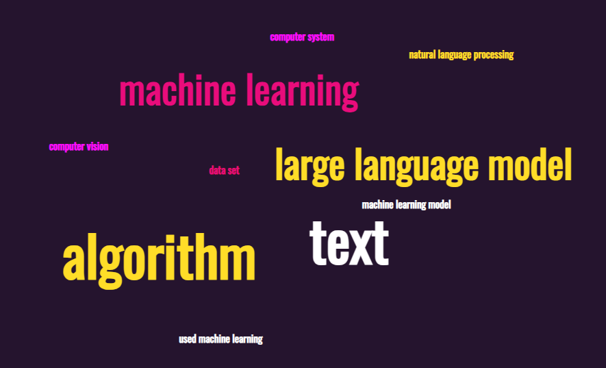
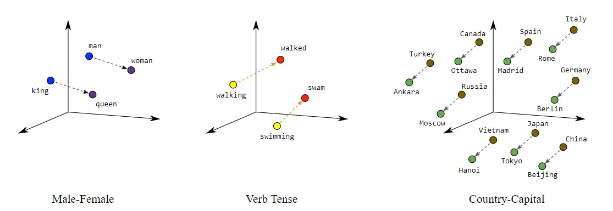
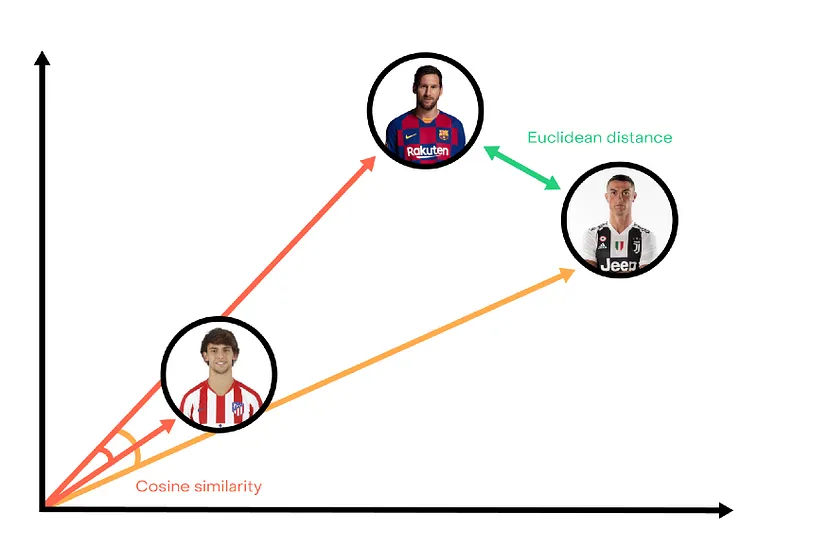
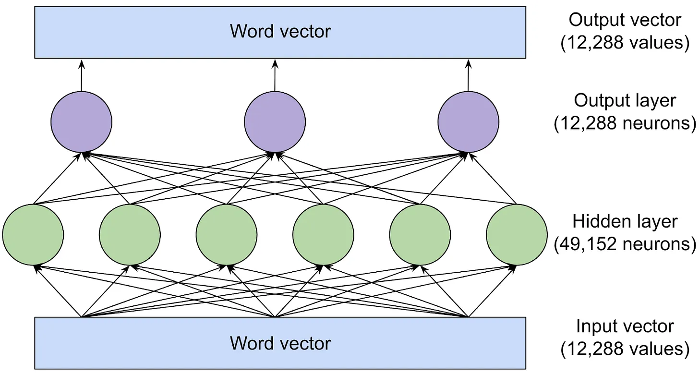
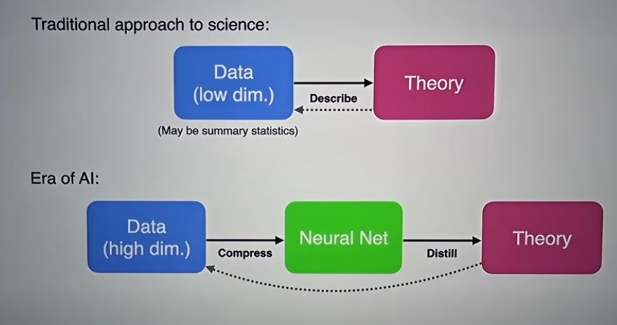
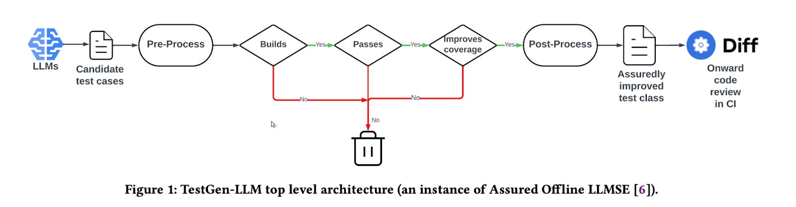

# Week 14: AI and Coding

---
# Agenda
- presentations: peer review form
- news
- lecture
- assignment

---
# Interesting news of the week
- Bayer eliminating 'bosses' allowing staff to [self-organize](https://fortune.com/europe/2024/04/11/pharmaceutical-giant-bayer-ceo-bill-anderson-rid-bosses-staff-self-organize-save-2-billion/)
- AI security: [NSA guidelines](https://www.nsa.gov/Press-Room/Press-Releases-Statements/Press-Release-View/Article/3741371/nsa-publishes-guidance-for-strengthening-ai-system-security/)

---
## Readings/Resources
LLM explainers:

- [High-level overview of generative AI (17-min video)](https://www.youtube.com/watch?v=2IK3DFHRFfw)

- Timothy Lee & Sean Trott, 7/27/2023, [_Large language models, explained with a minimum of math and jargon_](https://www.understandingai.org/p/large-language-models-explained-with)

- [More detailed look at transformers & math behind them (26-min video)](https://www.youtube.com/watch?v=eMlx5fFNoYc)

---
## Readings/resources

LLMs and programming:
- Somers 2023, The New Yorker, 11/20/23, [_A coder considers the waning days of the craft_](https://www.newyorker.com/magazine/2023/11/20/a-coder-considers-the-waning-days-of-the-craft)

- cs50 guest [lecture on LLMs + Programming](https://www.youtube.com/watch?v=JhCl-GeT4jw) (First 34 mins, stop at 34:46 - it is just an ad after that)

AI and Education
- [A high school student's views on education & AI](https://er.educause.edu/articles/2024/1/will-our-educational-system-keep-pace-with-ai-a-students-perspective-on-ai-and-learning%20)

---
## What is AI?

---
## What is AI?
[Coursera](https://www.coursera.org/articles/what-is-artificial-intelligence) defines it as: 
> _the theory and development of computer systems capable of performing tasks that historically required human intelligence_

This obviously encompasses a wide variety of technologies and techniques!

We will focus on text-based **Large Language Models (LLMs)**

---
## What are Large Language Models (LLMs)?
**large:** training datasets and the number of parameters (neurons) used
**language:** working with language (not images)
**models:** pre-trained to model the relationships among words in a number of ways
- generative models using a transformer architecture (a type of neural network)
- GPT = generative pretrained transformer

[7-min LLM section of cs50 lecture](https://www.youtube.com/live/0KmqnxXYJvA?si=oHNoVEwFQrySsjx4&t=3729)

---
## A brief history of how we got to LLMs

- **1972-mid 2000s:** 
Inverse document frequency (IDF) lived in statistical journals (N/appearances)

- **2008-13:**
TF-IDF (term frequency–inverse document frequency) and Natural Language Processing

- **2013:** word "locations" in physical space (word2vec)

- **2017:** transformer architecture
- **2022:** ChatGPT

---

#### TF-IDF and Natural Language Processing (2008-2013)
- **term frequency–inverse document frequency**: relates the frequency of a word in a document to its occurrence across a collection of documents
- "bag of words"
- matrices of word counts
- relative importance, "uniqueness" of words (words that appear once can have major impact in comparing two sets)
- crude measures of sentiment 
- word clouds

---

## Word "locations" in physical space: word2vec (2013)
- [word2vec](https://code.google.com/archive/p/word2vec/), vector representation of words ("geographic")
- word associations to each other, not just presence in a document
- can start to look at relationships among combinations of words or phrases that cluster together (n-grams)

---
### word2vec was great
...but things were still pretty rough in terms of analyzing text
- now had relation of words to each other
- mostly had corpus of public domain books
- could get sentiment measures via comparisons to Shakespeare
- had no real way to have relationships be persistent and updateable
- many manual steps and fragmented state of encodings (every researcher using their own datasets)

For comparison, in 2015, single image recognition tasks had ~95% success rate

---
### Transformer architecture and "attention" (2017)
- Vaswani et al. 2017, [_"Attention is all you need"_](https://arxiv.org/abs/1706.03762)
- introduced a new type of deep learning architecture, the transformer architecture
- each layer adds contextual information
- generates persistent encodings that can be revised and used as a future starting point
- since 2017, have added more and more layers, training, and effectiveness has improved with scale
- development led to release of GPT models and ChatGPT in 2022 (GPT-3)

---
## NLP: Then and Now
TF-IDF vs. GPT-4...

Would you learn more by chatting with ChatGPT or staring at a word cloud?

---
## How LLMs work (overview)

source: [understandingai.org, Lee & Trott 2023](https://www.understandingai.org/p/large-language-models-explained-with)

The article covers:

- how language models represent and reason about language (**word vectors**)
- the basic building block for systems like ChatGPT (**transformer**)
- how models are trained 

---
### Word Vectors
- A way to represent words as a vector, i.e. [0.034, 0.245, 0.0987]
- word2vec introduced the vector ideas of distance and directionality to language
- could “reason” about words using vector arithmetic
- each item in a vector represents a dimension, such as part of speech or whether it is a capital city
- more recent models contain many thousands of dimensions

Example: in a system using 300-item vectors to represent words, view the representation of the word ["orange"](http://vectors.nlpl.eu/explore/embeddings/en/MOD_enwiki_upos_skipgram_300_2_2021/orange_NOUN/)

---

### Vector math and inference

_image from [google developer](https://developers.google.com/machine-learning/crash-course/embeddings/translating-to-a-lower-dimensional-space)_

---
Vectors have distance (magnitude) and directionality (similarity)
_image from [towards data science](https://towardsdatascience.com/player-similarities-interpolation-aecbf6423c72)_

---

## Meaning is dependent on context
- a word can have multiple meanings
- meaning is derived from the surrounding words

**example: bank (financial institution) and a bank (of a river)**
- each has its own vector
- meaning has more influence than spelling; the vector for bank (financial institution) will be closer to the vector for the word "account" than to bank (of a river) 

---
## Transforming word vectors into predictions for the next word
- start with vector encodings for all words in the input text
- feed it into a neural network 
- each layer of the neural network is a **transformer**
- transformer updates hidden state vectors and passes to the next layer
- builds additional "understanding" with each successive layer
- moves from single-word attributes to larger, contextual interpretations

---
## A Transformer

From the Lee & Trott article:

_The transformer has a two-step process for updating the hidden state for each word of the input passage:_

1. _In the ***attention*** step, words “look around” for other words that have relevant context and share information with one another._

2. _In the ***feed-forward*** step, each word “thinks about” information gathered in previous attention steps and tries to predict the next word._

---
## Attention
Attention is likened to a matchmaking service for words:
- a **query vector** describes the characteristics of words that it is looking for
- a **key vector** describes a word's own characteristics
- query vectors and key vectors are compared for agreement using matrix multiplication
- information then transferred from the key vector word to the word that produced the query vector

---
#### Feed-forward
Once the attention heads transfer information between word vectors, the feed-forward network looks at these updated vectors and tries to predict the next word 
- uses information from the attention heads
- each neuron computes a weighted sum of its inputs, then looks for matching patterns
- patterns are determined by the training data
- when a neuron finds a match, it adds information to the word vector

---
Feed-forward, GPT-3 (circles are neurons):

---
## Attention and Feed-Forward

- attention heads retrieve information from earlier words in a prompt (compare context/relationship of words to each other)
- feed-forward layers allow LLMs to “remember” information that is not in the prompt (based on weights calculated during the training process)

---
#### Training the models (P = "pretrained")
- models are initialized with vectors of random weights (GPT-4 has ~1.8 trillion weights)
- examples are provided to the model (training data)
- weights are adjusted with additional training data
- training steps (run for _each word_ in the training data):
   1. forward pass: check if current weights produce the next word found in the data
   2. backward pass: use the information from the forward pass to go backwards and revise the relevant weights

---
## The Impact of Scale
- GPT-4 used ~13 trillion tokens (token = word, character)
- average 10-year old has encountered 100 million words
- [openAI found](https://arxiv.org/pdf/2001.08361.pdf) that an increase in model size, training size, and training compute greatly increased accuracy (up to 7x)
- model size increases only added accuracy with _more training data_

---

GPT-4 was trained only on text (no images), and having never seen what a unicorn "looks" like, was asked to draw one by writing code for an obscure graphics programming language (TiKZ). It produced:

---
## Areas of Impact
These models are wildly successful!!

Too many areas to mention...

How about areas directly related to this course:
- Education/learning
- Scientific inquiry [Miles Cranmer talk, 1 hr](https://www.youtube.com/watch?v=fk2r8y5TfNY)
- Programming/Software Development

---
## Impact on education
Takeaways by high school student William Yin:
1. Any technology can be used for good or bad; which depends on us
2. Educational system will have to adapt to new ways of accessing and processing information
3. Education will increasingly become personalized
4. AI-assisted learning will promote equality in education

---
## Impact on scientific inquiry (research)

Scientific inquiry is concerned with theorizing, collecting and analyzing data and establishing connections to support theories

This process consists of collecting data, analyzing and testing the data in support of establishing connections

**LLMs have billions of latent connections...**
- we now start with a massive set of established connections 
- probe and distill into theory

---
From Cranmer's talk:

---
## Impact on software development

Recall the Development stages:
- Plan 
- Code 
- Build 
- Test 
- Release 

Which stages will AI impact?  

---
## Software Development Process, before and after
**BEFORE**
1. requirements
2. user stories -> tasks
3. Code: Discuss Implementation details, pair programming
4. Review Code & check-in
5. Test

---
## Software Development Process, with AI assist
**AFTER**
1. requirements
2. user stories
3. "code": (a) feed stories into LLM, have it write code and tests, or (b) developer code with coding assistant
3. human review & check-in

---

# AI Tools (Text)
- Types
- Examples
- Resources

---

## Types of tools (Text)

- General/conversational
- Augmented Search
- Domain-specific (i.e. coding tools)
- _coming soon: Agents (converse + take specified actions)_

Differ with regards to:
- context/presentation of the application
- use cases and use patterns

---
## General/Conversational (examples)
General conversational agents: think ChatGPT
- Copilot 
   - free via [Edge browser](https://www.microsoft.com/en-us/edge/download)
- [Meta's Llama 3](https://www.meta.ai/)
   - free
   - available for download & use locally
   - [github repo](https://github.com/meta-llama/llama3)
- [Claude](https://claude.ai/)

---

## General/Conversational (Use cases)
Use cases
- ideation, generation
- summary
- Q & A

Skills
- [Brief intro to prompt writing](https://www.youtube.com/watch?v=pmzZF2EnKaA)
- tweaking: settings, "personas", models

---
## Augmented Search
Think google search that will summarize your query along with specific citations used to generate the response

- performs search (resrources)
- performs summarization (of search results)

Examples: 
- [phind.com](https://www.phind.com)
- [Notebook LM - searches and summarizes your notes](https://notebooklm.google/)

---
## Domain-specific: Coding Assistants

Many, many examples
Most simply provide an interface into the same model services

- models specifically trained on code
- more noticeable differences between models than among general assistants
- context (size) and other settings are more important

---
## Coding assistants (use cases)
- code creation 
   - can be based on description, input text, comments, etc.
- code suggestions/autocomplete
- code summary (generate documentation, comments)
- test generation

---
### Coding assistants (w/VS code extensions)
- llm-vscode (huggingface.com API needed)
   - create free account: https://huggingface.co/
- github copilot (student account / free trial)
- Cody (https://sourcegraph.com/cody)
- continue
- tabnine (have to sign up for free account)
- smaller (use Ollama locally): Twinny, Privy, ...

---
### Test generation
- any coding assistant
- conversational assistants

Issue is correctness/completeness of tests. Recent work into verifiable tests:
- [Meta's testGen-LLM](https://read.engineerscodex.com/p/metas-new-llm-based-test-generator)

---
TestGen-LLM:

---

### Local vs. External
**Local (your hardware)**
- need a smaller model, good open source: Ollama
- for coding, codellama 7B (~4 GB)
- using Cody to run Ollama locally: [7-min tutorial](https://www.youtube.com/watch?v=gY_E3QBZ-NE)
- [llamafile (single file)](https://github.com/Mozilla-Ocho/llamafile)
- Walkthrough to [run mistral from command line](https://simonwillison.net/2023/Dec/18/mistral/)

**External (someone else's hardware)**
- standard HTTP requests

---

## Configuration & Demo
1. llm-vscode
https://github.com/huggingface/llm-vscode#Configuration

2. Tabnine

---
## Where are LLMs going next? (Areas of active research)

Sampling of recent research papers

---
#### _Explaining How they Work_
- finding out what they "know" about topics, [article about the research](https://news.mit.edu/2024/large-language-models-use-surprisingly-simple-mechanism-retrieve-stored-knowledge-0325), the [research paper](https://arxiv.org/pdf/2308.09124.pdf)
   - knowledge stored in a transformer can be represented as relationship that connect subject and object
   - models decode relational information using a simple linear function, specific to the type of fact being retrieved
   - tested each function by changing the subject, probing models to produce a grid ("attribute lens") that visualizes where specific information about a particular relation is stored

---

### _Enhanced Reasoning Capability_
Adding context, awareness, discoverability
- [Using pseudocode to guide LLMs, research paper](https://arxiv.org/abs/2404.02575)

- [Teaching LLMs to reason](https://arxiv.org/abs/2403.09629)
   - attempt to have LMs generate "rationales" at each token to explain generated text & use it to improve their predictons 

---
### _Enhanced Functionality_
Unbounded context length
- https://arxiv.org/abs/2404.08801
- **context length** is the number of tokens from input text that the model considers when responding
- unbounded context length would allow for consideration of much more of your existing codebase

---

### _Reduced energy and memory consumption_
the bulk of any LLMs is matrix multiplication; processing billions of LLM model parameters is cpu and energy intensive
- [BitNet paper](https://arxiv.org/pdf/2310.11453.pdf)
- [BitNet modifications that puts it on par with much larger encoding models](https://arxiv.org/pdf/2402.17764.pdf)
- [youtube video: how to code/implement BitNet](https://www.youtube.com/watch?v=Zp8mKlKLphU)

---
## Bitnet and 1.58 bit imporvements
BitNet (1-bit)
- need new training (longer training due to added steps so that 1-bit can be used on the back end)
- provides huge speed up of inference times
- binary weights: [-1, 1]
- accuracy loss

---
### 1.58 bit models (modified BitNet)
- typical LLM stores weights in 16-bit floating point values
- 1.58 uses ternary weights: [-1, 0, 1]
- reduces precision of weights (16->2 bit) and activations (or output of a neuron, 16->8 bit)
- eliminates need for multiplication; only addition and subtraction b/c values are only -1, 0, 1
- inference efficiency gain (no training efficiency gains)
- matches end-task performance of 16-bit transformers

---

---
##  Looking to the future
- near future
- socio-technical
- extrapolating trends

---
### Looking to the IMMEDIATE future
- enhanced coding capabilities, improved workflows
- vastly improved learning curves
- continued adoption and ubiquity
   - penetration into new areas
   - refinement of existing uses
- "golden age of LLMs"? (proportion of valuable training data vs. artificially generated data)
- available to everyone

---
## Looking further into the future: Our tools affect us
our future with AI is not deterministic

we will be changed by these tools and we will change and shape these tools (intended and unintended ways)

---
## Specifically, our technological tools affect us

- habits (subconscious)
- ['pharmacology'](https://aeon.co/essays/bernard-stieglers-philosophy-on-how-technology-shapes-our-world) (physical)
- ideas (subconscious & conscious)
- how we see ourseleves in relation to the world (conscious)

---
## Trends & Fears

- a sample; by no means exhaustive
- from the perspective of someone who:
   - appreciates what the models have to offer 
   - thinks they are a great learning tool
   - hopes that everyone will have equal access to these tools
   - would like to see the tools continue to develop and remain effective

---
**Trend**: the share of AI generated content on the web is increasing

**Fear**: "pollution" of the internet
- current AI tools need human content
- they cannot be trained on AI-generated data and maintain quality
- with a few "generations" of AI-only training data, the models break down
- [impact of AI on the web - w3c](https://www.w3.org/reports/ai-web-impact/)

---
**Trend**: [competition for training data](https://www.reuters.com/technology/inside-big-techs-underground-race-buy-ai-training-data-2024-04-05/)

**Fear**: drives up costs, restriction of model use
- existing data has mostly been mined (subsumed within existing models)
- need additional sources of data; more players competing over smaller amounts of data (compared to what has already been used)
- will increasingly need streams of data as opposed to static purchases
- could ultimately lead to concentration of control over data 

---
**Trend**: lawsuits from copyright holders over training data

**Fear**: restriction of data, increase in cost to users, unequal access
- increasing lawsuits from copyright holders over the use of their data in training sets
- result in licensing costs/restrictions
- increased cost of data -> increase cost of tools
- increased cost of tools -> concentration of tools and data
- most likely to eliminate the low-cost models 
- rent-seeking behavior replaces innovation

---
**Trend**: awareness of privacy in general, specifically of the privacy of data in models

**Fear**: models become restricted
- similar to how GDPR was enacted in Europe in response to privacy concerns, models could be restricted or removed based on privacy concerns
- risk of regulatory overreach
- geographically splintered data sets
- models likely to be most affected are those that are free (no one has economic interest in defending/preserving)

---
## Trends -> Future
Like anything, there are risks and rewards

We have seen the remarkable effectiveness of these systems and their potential impact across society

Also looked at some risks and how things could play out negatively

---
### Future of coding: Apocalypse or techno-utopia?

#### Pros (listed before): 
- code creation 
- code suggestions/autocomplete
- code summary (generate documentation, comments)
- test generation

---
#### Cons:
- more niche applications may not have enough relevant data in training sets
- over-reliance can rewire our brains and reduce skill levels
   - [copilot enforced bad coding habits and atrophy in skill](https://www.youtube.com/watch?v=Wap2tkgaT1Q)
- as new languages are developed, the lessons and abstractions models have learned from prior languagues no longer make sense in the new context

---
### AI tools as part of a balanced diet
**embrace them**: use them where you can, learn from them

**don't become reliant on them**: 
- exercise your skills outside of the tools
- accept suggestions critically
- continue to think!
- recognize models for what they are: probabalistic, backward-looking (based on things that have already been committed to writing)
- be cautious when picking tools: privacy, security, use of your data

---
### Assignment: Future of Coding
**Instructions**
Your team project already complete; create a new branch named 'ai_dev' and experiment using an LLM. 

Experiment with both a general conversational assistant AND a coding-specific assistant (it doesn't matter which one you experiment with).

---
**Instructions (cont'd)**

When using general conversational tools, experiment with different prompt approaches:
- asking a single question
- multiple questions: an initial question with specific follow-ups
- frontloading with various contextual elements and desired output as part of a single prompt

---
**Instructions (cont'd)**
Ideas on what to do with the LLMs:

1. deploy your app to a server - use an LLM to determine appropriate tooling
2. add desired functionality - fix existing issues, code tasks you didn't get to in Milestone 2.0 OR completely new ideas; brainstorm as a team and use LLMs to implement
3. have it refactor segments of your codebase

---
**Writeup**
Document your experience using both the general conversational tool as well as the coding-specific tool, inclding:

- what approaches worked well, what didn't
- areas it struggled with, areas it was great in
- comparison of the code generation abilities of general assistants to that of the coding-specific tools
- note which tools and model(s) you used
- how would you recommend students/developers use it
- what skills do you need to develop

