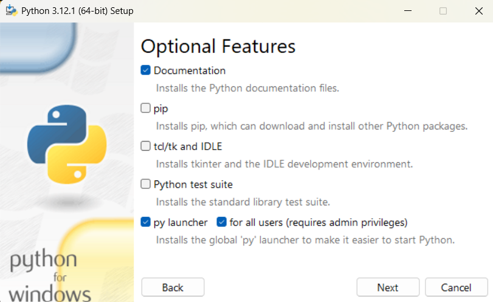

#### IST 303: Software Development (Spring 2024)

# Week 1: Introductions

## Classroom Introductions
### Instructor & Students
### Course Materials
- [Syllabus](https://cgu.instructure.com/courses/12667/assignments/syllabus)
- [Readings](https://cgu.instructure.com/courses/12667/pages/resources-and-materials)
### General programming/dev resources
  - [Hacker news](https://news.ycombinator.com/)
  - [Lobste.rs](https://lobste.rs/)
  - [Reddit programming](https://old.reddit.com/r/programming/)
  - [Devurls](https://devurls.com/) (aggregator)

### Course session setup/flow
Practical Elements
- Textbooks
- Walkthroughs
- Exercises (in class and out of class; individual, paired, and groups)

Academic Elements
- Journal articles
- Discussions
- Reflections

How will they mix?
- Hope to provide a solid foundation across a number of tools; becoming proficient in those tools is up to you
- Jump back and forth from minute details to larger broad topics, each time bringing them closer together in our minds
- Eventually it will be smooth sailing:

### These files
- [markdown format](https://markdownguide.org/cheat-sheet/)
- [available on github](https://github.com/damapak/ist303_spr2024)

## Introduction to Python and the command line

Install Python

#### Linux & Mac: Python 3 installed by default.    
- Install additional versions from https://www.python.org/downloads/ or use your package manager to install additional versions.
#### Windows
- Download and install Python 3.7 or greater from https://www.python.org/downloads/
- check the box that says "Add Python to PATH" 
  - this will add the python executable to your PATH environment variable, which is a list of directories your computer searches through for executables before giving up
- recommended to use admin privileges to install for all users 
- optional features
  

#### Why 3.7?
   - virtual environment manager installed by default (venv, 3.4+)
   - pytest (3.7+)
   - f strings (3.6+)

Install an Editor

### Text Editor vs. IDE
#### Text Editors
- edit text
- examples: vim, [neovim](https://neovim.io/), emacs, sublime text
#### IDE
- help you write and run code
- syntax highlighting, code completion, debugging, linting (static analysis)
- examples: [VS Code](https://code.visualstudio.com/), pycharm, IDLE

Install Git

- [Git](https://git-scm.com/book/en/v2/Getting-Started-Installing-Git)

### [IDE Exploration](week01_02_myInstall.md)

