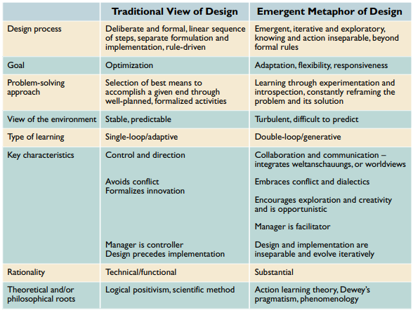
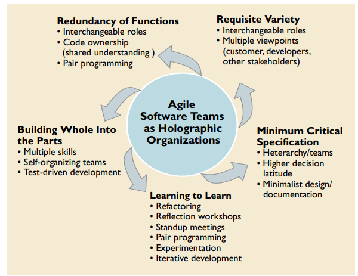

# What is Agile?
- Set of guiding principles
- Response to predominant software development methods and processes at the time
- "Waterfall" development
  - Highly specified documents from the start
  - Planning and Implementation were sequential stages
  - Failures: projects not meeting needs, developer burnout
  - response was to make the process more tightly controlled

---
### [Manifesto for Agile Software Development](https://agilemanifesto.org/)

We are uncovering better ways of developing software by doing it and helping others do it. Through this work we have come to value:

***Individuals and interactions*** over processes and tools 
***Working software*** over comprehensive documentation 
***Customer collaboration*** over contract negotiation 
***Responding to change*** over following a plan

That is, while there is value in the items on the right, we value the items on the left more.

---
### [Principles of Agile #1-4](https://agilemanifesto.org/principles.html)
Our highest priority is to satisfy the customer through early and continuous delivery of valuable software.

Welcome changing requirements, even late in development. Agile processes harness change for the customer's competitive advantage.

Deliver working software frequently, from a couple of weeks to a couple of months, with a preference to the shorter timescale.

Business people and developers must work together daily throughout the project.

---
### Principles of Agile #5-8

Build projects around motivated individuals. Give them the environment and support they need, and trust them to get the job done.

The most efficient and effective method of conveying information to and within a development team is face-to-face conversation.

Working software is the primary measure of progress.

Agile processes promote sustainable development. The sponsors, developers, and users should be able to maintain a constant pace indefinitely.

---
### Principles of Agile #9-12

Continuous attention to technical excellence and good design enhances agility.

Simplicity--the art of maximizing the amount of work not done--is essential.

The best architectures, requirements, and designs emerge from self-organizing teams.

At regular intervals, the team reflects on how to become more effective, then tunes and adjusts its behavior accordingly.

---
That forms the foundation for agile software development. As with any human endeavor, there are a number of ways these can be interpreted and operationalized.

These principles form a philosophy, almost religious in terms of how they are used.  They have spawned a number of methods with various principles. 

[Agile Subway Map](rsc/agile-subway.pdf)

---

### How will these principles be brought into the course?
- Practical: use in exercises and the team project
- Pilone & Miles text
- Readings
- Explorations of some of the more popular methods

---

## Where does this course fit in CGU's IS&T programs?
- Information systems is at the intersection of social science and computer science
- Informed by practice, design science, and theory
- Many of the readings will have a social science/ management/ organizational behavior component
- Software development has spawned [some research interest](rsc/sd_journal_list.md)
- Review Nerur & Balijepally

---
## Nerur & Balijepally 2007
Presents software development as a "wicked problem", one where:
- the problem is complex and difficult to articulate
- the problem does not have a static solution and changes over time
- multiple conflicting viewpoints are present (no easily identified desirable outcomes to optimize)

Applied design lessons from what field(s)?

---

# Evolution of Design Thinking
### old methods characterized by:
- formulaic and prescriptive thinking (advanced knowing)
- mechanistic worldview: predictable, verifiable, controllable
- past experience (backward looking)

### new methods characterized by:
- emergent processes centered around learning
- constant questioning through cycles of formulation, implementation and reflection
- dynamic worldview: uniqueness, ambiguity, complexity and change
- new/oud summarized on pg 82 (next slide)

---
pg 82
 

---
 
Fig 2:
Agile +
Holog-
raphic

---
### Key organizational principles
- value dependent on org ability to nurture leaning, teamwork, personal empowerment
- _"heterarchical"_ structure: any unit can govern or be governed by others, depending on circumstances 
- _"holographic"_: each piece of the org has within it the information to reconstruct the whole (redundancy + capacity to learn/evolve)
- idea of "minimal critical specification"
- _"adaptive software development (ASD)"_ (Highsmith): \
speculate -- collaborate -- learn
- _"double-loop" learning_: learning to learn

---
### Subway map
Places you'll find them:
- research articles (N & B 2007)
- blog posts
- books (Pilone & Miles)
- consultancy groups
- within organizations

Sometimes will be explicitly called out and obvious, others more implicit or referenced with different terminology

---
### How to use the subway map
- Do not attempt to memorize them all! 
- Document and notate as you come across them (you'll increasingly see connections between them)
- Track/star/highlight those you have used and find useful
- Use for ideas/inspiration during your team project - experiment!
- Fill in gaps in your knowledge/review concepts (pdf is hyperlinked)
- text version for easier note-taking available [here](Agile_Subway_Glossary.md)

