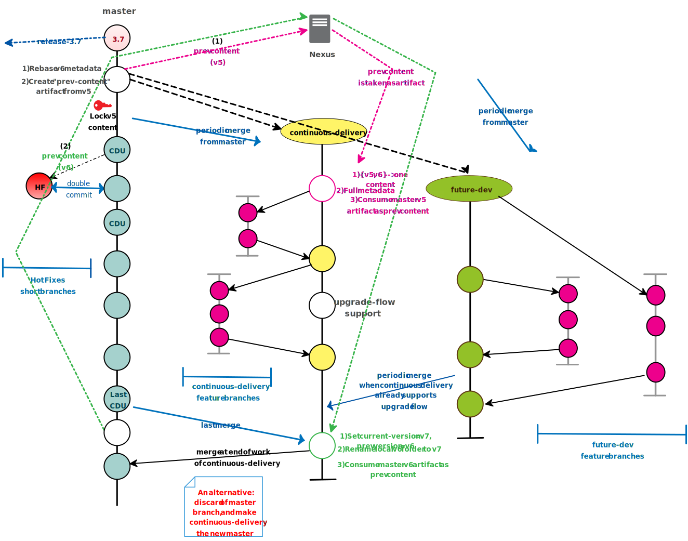
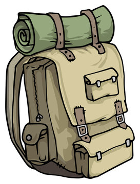
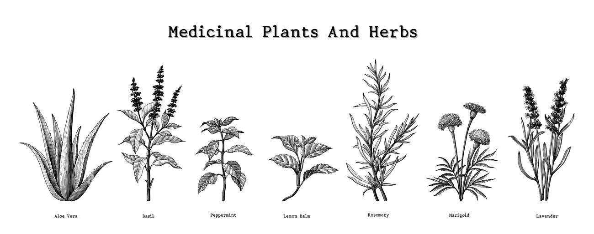
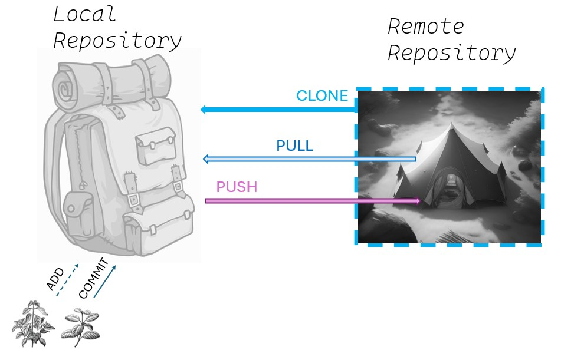
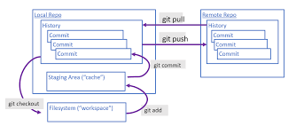

## <!--fit--> Introduction to Git and Github

---

## Git Flow Simplified

---
What is Git?

A version control system. A system for methodically tracking and managing changes to a codebase. Can communicate changes made locally to remote (web-hosted) code storage locations (remote repositories).

What is Github?

A place to remotely store a codebase where you and others can access and manipulate it with Git.

---
## CAMP =

## REMOTE REPOSITORY (Github, Gitlab, Bitbucket, etc.)

_*This is a special tent with one magical property: with the push of a button you can copy all the tent's contents into your backpack (`git clone`)_

---

## BACKPACK =

## LOCAL REPOSITORY (your computer files)

Your backpack consists of 3 parts:
- Existing contents (_working directory_)
- Notepad to track what you will add (_Index_) `git add`
- Original contents plus those you have tracked and then add (_Head_) `git commit`

---

##### While at camp, your team realizes you forgot some items and you need to go out and gather the following:

- Food
- Medicine
- Fire supplies (wood, kindling, striking rock)

You and 2 of your teammates push the magic button, creating identical copies of all tent contents in your packs. The 3 of you then head out in separate directions, with a 4th team member remaining at camp.

<==---- -||--- ==> 

---
You have been assigned to provide medicine for your team and embark on your expedition.

As you explore, you observe several potential medicinal plants. You pull out your notebook and begin to write down those you plan to harvest (`git add`)
-- ---

---

Having noted a number of plants, you now go back and harvest them. You try some of them on a red irritated area of your skin, and it relieves the itching. You are confident what you have collected will fit the needs of camp and *you place them in your backpack* (`git commit`) 

You head back towards camp, and remember that while the mesquite tree has medicinal uses, the pods are also edible. You want to check back with camp to see if anyone has brought back mesquite as a food source. You radio camp and find out that there have been no changes to the tent's supplies (`git fetch`)

---

You hasten back towards camp and deliver all of the new medicinal capabilities stored in your backpack to your camp (`git push`) 

Shortly after, the other team members also radio back to camp (`git fetch`) and see what you have delivered. 

They wish to have the contents you have added to the tent in their backpacks too, and they radio camp to have drones deliver copies of these items so that their packs are up-to-date with camp (`git pull`)

---
  

---
Another way to visualize it:
 

---

[installation and setup](week02_02_src.md)

