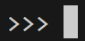
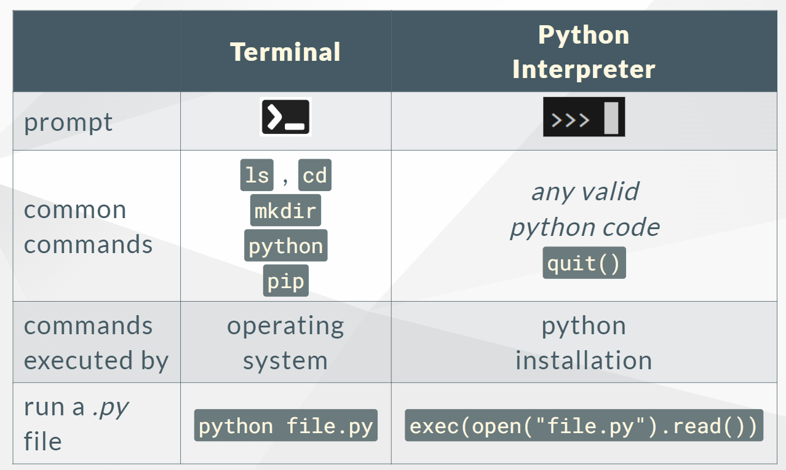

# Quick review of what was covered last week
- Terminal
- Python Interpreter
- Text Editor
- Integrated Development Environment (IDE): combines the prior 3

---

### Terminal (Powershell, Zsh, Bash, Command Line)
Commands entered in the terminal are executed by your operating system (can execute via programs in your PATH variable). The Terminal is where you will set up and configure your projects. 

**Use the terminal if you want to:**
- Install programs or python packages like flask (`pip install`)
- Manage and create directories and files, including virtual environments
- Navigate your filesystem (change directory, create or remove)
- use Git commands to manage your project changes
- run python files (`python filename.py`)
---

## Python Interperter
The python interpreter is an interactive coding session, where anything you enter will attempt to be executed as python code by your python installation.

**Use the interpreter to learn about python and to test out smaller code snippets.**

- Start using the `python` command from your terminal
- Exit back to terminal with `quit()`
---

## Text Editor/IDE
A text editor is like a notepad: open files to edit them and save your changes. 

**A text editor is the primary application you will use to write your code.**

An IDE combines a text editor and a terminal, along with code execution capability and other helpful tools such as code suggestions, syntax highligting  and debugging. 

---

| | Terminal  | Python  Interpreter |
|-| :-----------: | :-----------: |
|prompt |       |        |
|common   commands | `ls` , `cd`   `mkdir`   `python`   `pip` | _any valid   python code_   `quit()`
|commands   executed by | operating   system | python   installation |
| run a _.py_   file | `python file.py` | `exec(open("file.py").read())` 

---
Duplicated as an image file below:

---
#### Outside of VS Code: accessing components separately
- terminal
- text editor
- file explorer
- python interpreter `>>>`
#### IDE: _VS Code Demo_
- where to find above functionality
- extensions (install the python one)
- for more info: 7-minute [VS code intro](https://www.youtube.com/watch?v=B-s71n0dHUk) 
---

[Week 2 slides](week02_02_slide_git_gh.md)
