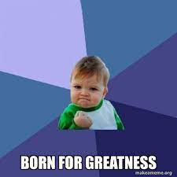
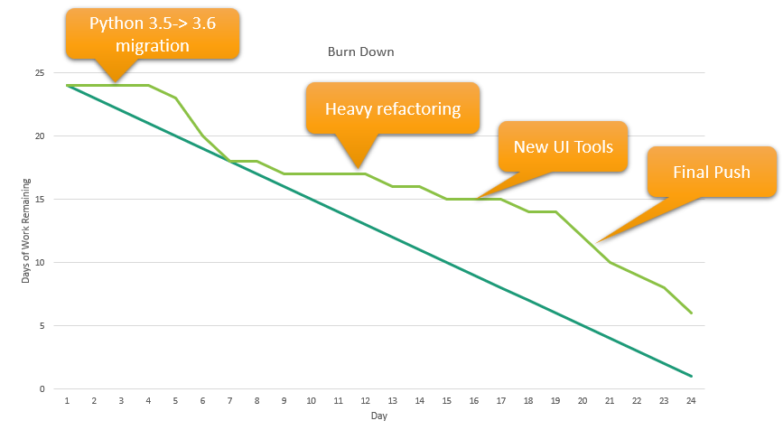
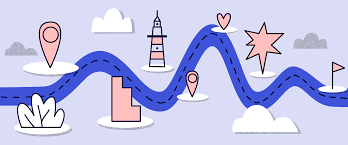
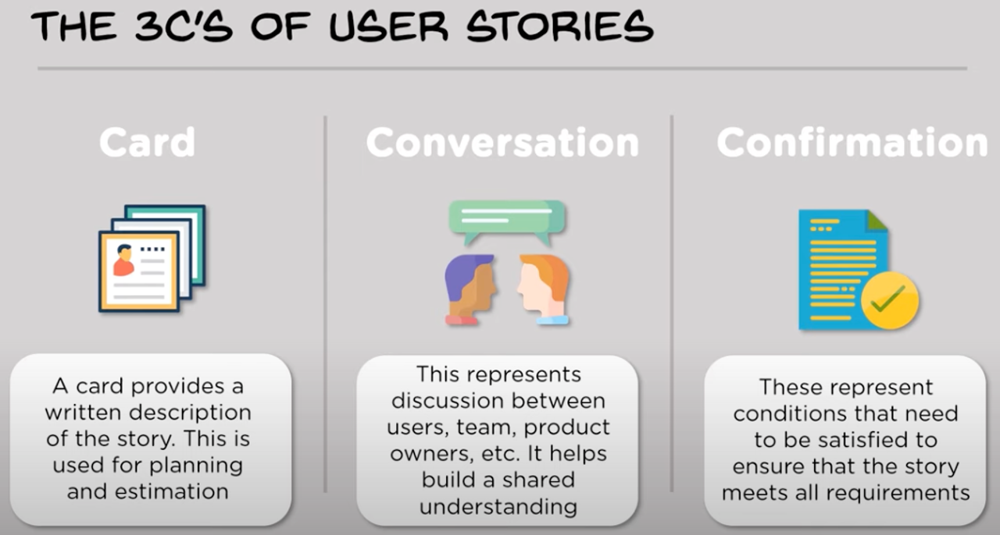
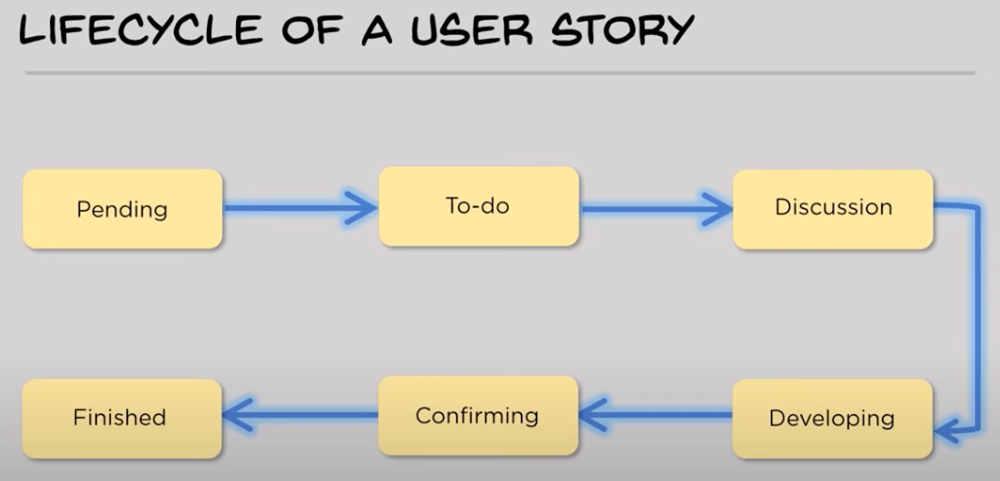

## <!--fit--> Pilone & Miles Ch 1:  Great Software   Development

---
### What makes great software?
- it is what the customer wants
  - ask, ask, ask: remove all assumptions
- it is on time 
- it is within budget

_Anything else?_

---
### Iteration
Wikipedia:
_Iteration is the repetition of a process in order to generate a sequence of outcomes_ 

In software development, an _Iteration_ is:
- fixed length of time (roughly 1 month, ~20 working days)
- at the end of the time you have working software that contains a set of features
- required features are assigned to iterations based upon customer priorities and developer time estimates

---
### Iterations involve
- all stages of a complete process: 
`requirements -> design -> code -> test`
- production of complete, working software
- check-in with customer at the end to demo
### Quality software through iterations
- software gets more complex and complete with each iteration
- Iterations combine to produce milestones and releases
- after final iteration, software is what the customer wants?

---
### Customer-driven rules for success:
1) the customer is always right.
2) when in doubt, refer to rule 1.

A project that does not provide what the customer wants is a failure.
It doesn’t matter whether the customer ‘signed off’ on requirements at some point.

_What is there to like and dislike about this philosophy?_

---
### Agile in action: making adjustments
- When new features arise, they are fit into remaining iterations, based on customer priorities and developer estimates of time needed
- If doing this would push the due date, the customer decides what to do:
  - drop features
  - extend due date

_what if the customer won't do either?_

---
## <!--fit--> Pilone & Miles Ch 2:  Gathering   Requirements
---
### Requirements
A requirement is a _single thing_ the software has to do.

- Where do initial requirements come from?
- Refine requirements by talking to the customer
  - clarify existing requirements 
  - uncover additional requirements
- good requirements must include the right stakeholders
- try as many techniques as needed

---
### Getting requirement information from customers
- Bluesky: brainstorming session where anything is on the table
  - ignore feasibility
  - dream about big ideas
- Find out what people do
  - role play: customer attempts to do their job with you as the "software"
  - observation: watch how people are currently doing their job (do this multiple times with multiple people)
- ask, ask, ask
---
### Requirements and User Stories
Remember, a **requirement** is a single thing the software has to do. 
A **user story** is essentially a requirement that is written from the user's pespective: a story about how the users interact with the software.

A good user story:
- describes one thing the software needs to do
- is written in language the customer understands
- is written by the customer (their words/ideas, not necessarily their handwriting)
- is short: no more than 3 sentences. _What if there is more to say than this?_

---
### What user stories are NOT
- design decisions
- long essays
- filled with technical terms users do not understand
- technology specifications (they should not mention any technologies)

---
### Developing a set of requirements
The set of requirements describes WHAT your software should do.
- capture basic ideas
- bluesky
- construct user stories
- ask, ask, ask: refine/clarify/correct user stories

Repeat this process every iteration.
Recall an iteration is a cycle of:

`requirements` -> design -> code -> test

---
### Estimates
User stories contain the WHAT of your project, estimates provide the WHEN.
Need to be able to answer the question, “How long will this take?”

The project estimate is the sum of estimates for all your user stories. You need to estimate how long you think each user story will take to develop, including time to _design, code, test, and deliver_.

Each team member:
- Reviews each user story
- notes a time estimate for each
- includes any assumptions that are a part of their estimate

The team then meets and discusses the estimates and assumptions. 

---
### Review Poll
- what gets estimated
- who does estimation
- what is a good iteration duration
- milestone vs. iteration length
- what is a good user story duration

---

### You try it
How long would it take you _in hours_ to:
- shop for, prepare, taste test, and ship a chocolate raspberry cake?

- type your number in chat but do not hit enter

---
### Planning Poker
An estimation tool that integrates the knowledge of everyone on the team to arrive at good estimates. Use to refine user story estimates when the initial estimates diverge.

- contains the following cards: \
`0`, `1/2`, `1`, `2`, `3`, `5`, `8`, `13`, `20`, `40`, `100`, `?`, `break`
- place a user story in the middle
- everyone places one of their time cards face down on the table, turn them up simultaneously
- dealer marks spread
- discuss large spreads, tease out assumptions and get customer clarification if needed
---
### You try it: 
How long _in days_ would it take you to:
- deliver code where a user can create an editable note in their browser?
- go to the jamboard: https://jamboard.google.com/d/1AjMkOxwMeCC2RCY-7kpie7gL0H1G6x4tunKn876vEyw/viewer?f=0
- select one of the sticky note values
- copy and paste it on the left side of the line

---
### Planning poker outcomes and questions
- What do you do with a really large spread?
- What do you do with assumptions?
- What happens if you can’t eliminate them all?
- How long is too long for a user story estimate?
- What does it mean if your estimate of a user story is too long?

---
### Getting a Final Estimate
- Use “converged estimates” (consensus estimates) resulting from cycles of:
  - talking to customer
  - planning poker
  - assumption clarification
- Add them up
- Prepare to be shocked
- What do you do when the total is too long?

---
## <!--fit--> Pilone & Miles Ch 3:  Project   Planning

---
### Prioritize with the customer
You can expect that:
- Customers want their software when they need it
- Developing everything the customer says they want can take too long

Make sure to communicate:
- Customer sets the priorities
- Must decide what to include in Milestone 1.0

---
### Milestone 1.0
- First major release
- First time to “get paid”
- Focus only on what’s needed
- Customer decides which features to include
- Time required for work must fit within time available
---

### What if required features don't fit in the available time? 

- Cut functionality - remove user stories not absolutely essential fo functioning software
- Ship a milestone build as early as possible - focus on an early success to gain momentum
- Push to later milestones all features not essential to baseline functionality
---
### Why not just add to your team? 
- New team members must get “up to speed”:
  - Must understand the software, technical decisions, how everything fits together
  - acquire right tools, equipment
- Negative relationship between number of people and communication
- “Inverse U” relationship between number of people and productivity

---
### Planning for Milestone 1.0
- Establish team size
- Estimate person-days of work to be done
- Determine person-days available
  - exclude weekends
  - account for overhead days: vacations, sick days, meetings and other work, non-productive days (tool install, email, etc.)
- Calculate excess work in project (estimated – available)
- Keep iterations short (allows more feedback)
- Keep iterations balanced (changes, new features, bugs, etc.)

---

### Estimating project schedule: Velocity
_Velocity_ is the way to account for all the overhead days and non-project work time. Given a number of work days, it is the % of that time that is productive work. 

A decent starting velocity is 0.7 with a new team. Adjust as needed with each iteration. Be sure it reflects the most accurate, realistic estimate possible.

---

### Estimating project schedule: Days required to get work done
Take your estimated days of work needed for development and divide by the velocity.

Weekdays needed for project =
days of work / velocity

---

### Estimating project schedule: Work Days Available
Start with calendar days, then account for weedends and velocity.
- Calendar days = due date – current date
- Weekdays = calendar days – weekend days
- Available days = weekdays * velocity
- Work days = available days * size of team

Compare available days with weekdays needed

---

### Example Milestone Time Estimate (1/2)
Project overview:
  - 200 estimated work days (only priority user stories, best estimate)
  - 4 member team
  - 3 month due date

Available Days (adjust for weekends and velocity)
- calendar days: 90 (3 months)
- weekdays: 90 * 5/7, or 64 days
- available days = 64 * 0.7, or 45 days
- **total work days available** = 45 days * 4 team members, or **180 days**
---
### Example Milestone Time Estimate (2/2)
Available: 180 days
_After accounting for velocity and weekends, there were 180 available work days across your entire team._

Needed: 200 days
_There was an estimated 200 work days needed._ 

The number of needed days exceeds the number available:
- 200 needed - 180 available = 20 days

**Therefore, 20 days of work needed to be re-prioritized.**

---

### Use Velocity when planning iterations
The prior example looked at applying velocity to re-prioritize features to make sure you can deliver what is needed on time. You can use a similar technique to time-check your iterations.

Apply your velocity to iterations:
- _Iteration work capacity = \
team members * working days in iteration * velocity_
  - 4 people * 21 work days/iteration * 0.7 = \
60 person-days per iteration
- Add iterations to get total milestone estimate 
  - 60 days * 3 iterations = 180 days until milestone can be completed

---
### Managing customers
Your iterations are all mapped out, and you realize you can’t get all the work done for Milestone 1.0 in the planned number of iterations. 

What now?
- Add an iteration (longer development schedule)
- Request deferring some user stories to Milestone 2.0
- Be transparent about how you came up with your estimates
- Do NOT overpromise

---

### The Big Board (pg 100)
A software development dashboard to track the current iteration progress. Helps track:
- What work is in progress
- What’s in the pipeline
- What’s done
- Burn Down chart

---

### Burn down chart
Plots total work left in the iteration against days remaining
- “ideal” line goes from amount of starting work to zero work at the end
- “actual” line comprised of points added based on your estimates at meetings
- It’s good when the actual points are below the ideal line!

---
## Sanity break: Where we're at
- Capturing basic ideas
- Brainstorming 
- Construction of user stories
- Refinement of user stories with customer feedback, resulting in clear and concise user stories
- User story estimation
- Clarifications from customer, refinement of user stories, elimination of assumptions
- Project estimation

---
## <!--fit--> Pilone & Miles Ch 4:  User   Stories

---
### User stories

Broad definition from earlier: a story about how the users interact with the software.

Refine this to be a bit more specific:
***the smallest piece of work that represents some value to the end user and can be delivered during a sprint***

User stories are always:
- user-centric
- written to capture a function of the software

---
### I.N.V.E.S.T. in good user stories
- **Independent**: _can be developed in any sequence; changes to one don’t affect others_
- **Negotiable**: _team decides how to do them_
- **Valuable**: _each user story gives the client one thing she/he wants_
- **Estimable**: _able to guess how long it will take to do it_
- **Small**: _one sprint sufficient to design, code, test_
- **Testable**: _clearly defined acceptance criteria_

---

## User story format
As a **[type of user]**, I want **[an action]** so that **[a benefit/a value]**

As a **passenger**, I want to **link the credit card to my profile** so that I can **pay without cash quickly and easily**

---
### Acceptance criteria
The criteria for satisfying the functionality described in a user story. These are subjective by nature.

Sample User story: \
As a rideshare passenger, I want several available drivers to be displayed so that I can choose the most suitable option for me.

Possible acceptance criteria: 
- App shows drivers who have been online recently and don’t have rides
- App shows drivers closest to user
- User can browse a list of drivers

---
### What good are user stories?
- Allow you to:
  - manage backlog of features
  - provide time estimates
  - prioritize functionality
  - plan
- Keep you focused
- Enable creativity
- Keep the development customer-centric
- Allow project to be managed effectively
- Finishing them feels good!

---
### How to write user stories
- originally "written" by customer (_product owner_, or customer rep, in scrum)
- steps for your team to take:
  - list end users whose needs you are trying to satisfy
  - define the actions they would need to take
  - think about the value these actions would have (would anyone pay for this)
  - discuss acceptance criteria
- always keep the focus on users
- think about external AND internal customers (what employees might need to do their work)
- limit to one action per story; action is what it does for the _user_
- discuss and eliminate assumptions/ambiguities

---

_source: simplilearn scrum master course_

---

## User Story Tips
- Listen to feedback
- Hold off on details
  - focus on WHAT, not HOW
- Keep as concise as possible
- Record on index cards, post-it notes, or project management software

---

_source: simplilearn scrum master course_

---
# Tasks
A ***task*** is a description of functionality that supports completion of a user story. It is a very specific piece of development work that needs to be accomplished by an individual developer as part of satisfying a user story.

User stories are broken down into tasks, with each story typically containing multiple tasks.

Tasks:
- are NOT user stories
- should include implementation details necessary for its development
- need a title, a description, and an estimate
_how could they be estimated?_

---

## So many estimates...
At each stage of development, we have been estimating the work remaining, comparing it to available time, and revising the plan accordingly. In a way, we are iterating towards more reliable estimates.

Have moved from left to right:
- `Requirements` --> `User Stories` --> `Tasks`
- `Milestone` --> `Iteration` --> `Sprint`

---

## Planning with Task Estimates
Revise your remaining work estimates after estimating tasks
- shorter estimates are more reliable than longer ones
- smaller scope yields more accurate estimate
- update your burn-down chart

---

## Work on Tasks
- Assign each task to a developer
  - who would be best, or
  - whou could benefit/learn the most
- Can bundle tasks if there is a good reason to do so
- typically work on one task at a time
  - _when would deviations be acceptable?_
- keep everyone busy, but not _too_ busy

---

### Updating your Big Board
- add tasks to the big board (they will all be associated with their user story)
- move tasks actively being worked on into "in progress" swim lane
- completed tasks get moved to "completed" section
- when all tasks for a user story are complete move the user story to "completed"
---

## Meeting with your team
- Track group progress
- Update burn-down rate
- Update tasks
- Talk about what happened since last meeting
- Discuss what will occur between now and next meeting
- Bring up any issues
- Frequency & Duration
  - Scrum: Daily, 5-15 mins
  - Team project: 2+ times per week, 10-30 mins

---
## Adding Tasks
#### Developer
- sometimes you identify new work that could save time later

#### Customer
- wants something new
- talk to them about implications

These unplanned tasks must estimated, added to the big board and tracked like any other - they will add work to your burn-down.
