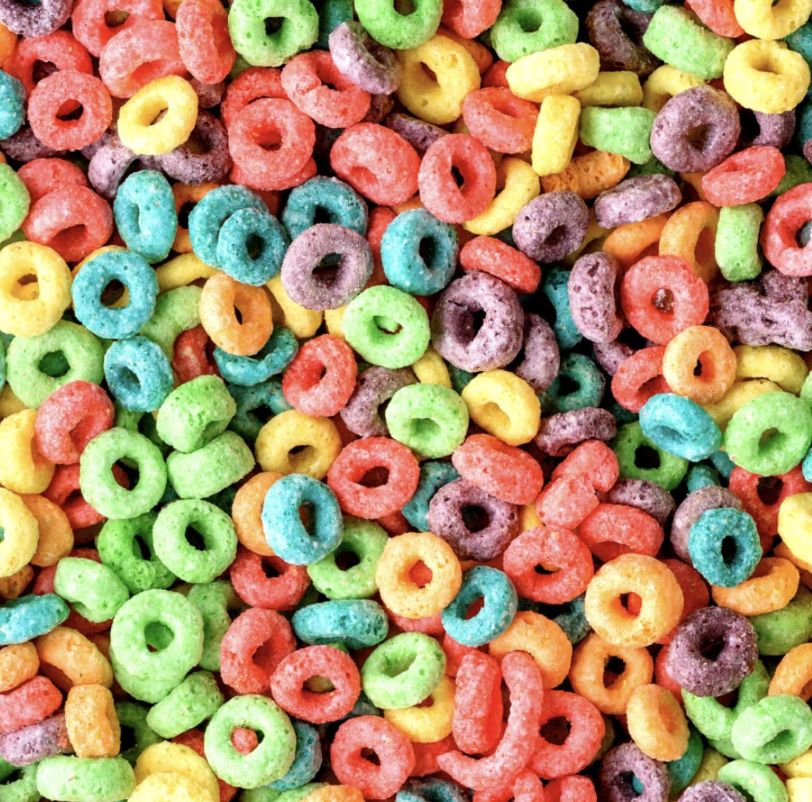
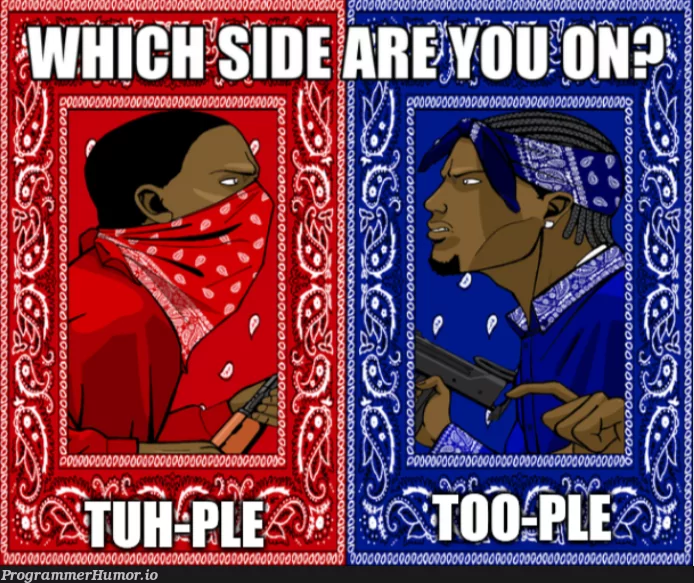

# <!--fit--> Lubanovic <br> Ch 6: <br> Loops


---
# The `if` Statement

`if` _condition_ `:` _code to execute_

- single line, as above
- multiple lines where _code to execute_ must be indented:
```
area_rect = 9 * 12
if area_rect > 100:
  print("area larger than 100")
```
---
### Walrus operator  :=
In the previous example, we had two lines representing variable assignment (using a formula) and the use of the calculated result in an _if_ statement:
1) `area_rect = 9 * 12`
2) `if area_rect > 100:`

The walrus operator `:=` combines them into a single statement: \
`if [object] := [object assignment] [condition]: ... `
```
if area_rect := 9 * 12 > 100: print("area larger than 100")
```

---
# `while` loops
`while` _condition_ `:` _code to execute_

A while loop will execute until the condition is no longer True. 
Example:
```
num = 1
while num < 5:
  print(f"{num = }")
  num += num
```
_To break out of an infinite while loop in the python interpreter, use `ctrl` + `c`_

---
# `for` loops
`for` var `in` iterable `:` code to execute

for loops iterate over some iterable object and conclude after reaching the end of the object.
```
for ltr in 'bamboo': print(ltr)
for item in ["laptop", "water bottle", "notepad"]: print(item)
```
---
### Creating iterable objects with range
`for` _can_ iterate over any iterable object (string, list, tuple, dict, set), but you don't _need_ a predefined object to iterate through.

For is often used in conjunction with the `range()` function. Range can take:
- a single integer, such as `range(5)`, or 
- a beginning and end value as in `range(1,6)`

```
for nbr in range(1,6): print(nbr)
```

---

## `if` vs. `while`/`for` 
An if statement is checked once and only once, when the `if` statement is encountered.

While (and For) both run the loop a number of times, until some condition is met. 

- while loop runs until the condition is no longer True
- for loop runs until it reaches the end of the iterable object it is traversing through.

---
## Loop Control `while`/`for` 

`break` : stop execution of current loop and skip all future loops

`continue` : skip the current iteration of the loop (continue to the next)

`else:` 
  - saw this with an `if` statement, `if:`...`else:`
  - can also (unintuitively) use to execute code when a loop successfully gets through all iterations (i.e. no breaks) - "break checker"

---
### Combining control flow statements and loops
You can nest statements inside each other for added control flow.

Say we have a bag of fruits (a list) and we want to pull out a random fruit from the bag and try it, until none are left. For fruits we know, we will print out a message specific to that fruit, for all others we will print out a standard message with the fruit name.

We can do this with a combination of statements, in this case nesting an if block inside a while loop.

---
###  _`Nesting`_ __`//\\/\`

```
# randfruit.py

from random import randint
fruits = ['watermelon', 'orange', 'apple', 'persimmon', 'pomegranate', 'kiwi']

while True:
    index = randint(0,len(fruits)-1)
    random_fruit = fruits[index]
    if random_fruit == "orange":
        print(f"that orange was very juicy.")
    elif random_fruit == "watermelon":
        print(f"that watermelon wasn't quite ripe")
    elif random_fruit == "apple":
        print(f"that fuji apple was crisp and sweet!")    
    else:
        print(f"what fruit was that? Oh, a {random_fruit} you say. Not bad!")
    fruits.remove(fruits[index]) 
    if len(fruits) == 0:
        break
```

---
### Can we do better?
- 'while True' should send warning bells ringing - easy to forget / make a mistake regarding breaking out of the loop
- using `len(var)-1` syntax can be error prone; have to remember if you need the -1 or not 
- do we need the last `if` check to break out of the loop? Having an `if` statement at the same indent level as another `if` can be hard to read/reason about

_python has so many bulit-in functions, including methods for its data types, you want to start there: often clearer to use, optimized to run faster_

---
```
# randfruit_pop.py

import random
fruits = ['watermelon', 'orange', 'apple', 'persimmon', 'pomegranate', 'kiwi']

while fruits:
    random.shuffle(fruits)
    random_fruit = fruits.pop()
    if random_fruit == "orange":
        print(f"that orange was very juicy.")
    elif random_fruit == "watermelon":
        print(f"that watermelon wasn't quite ripe")
    elif random_fruit == "apple":
        print(f"that fuji apple was crisp and sweet!")    
    else:
        print(f"what fruit was that? Oh, a {random_fruit} you say. Not bad!")
```
_other control flow combinations?_

---
# Lubanovic Ch 7: Tuples and Lists


---
### Tuples
- tuples are immutable objects that contain a series of other objects.
- created with ( ) or convert other types to tuple with tuple()
- these all create the same tuple:
```
1,2,3
(1,2,3)
tuple([1,2,3]) 
```
`t = (1,2,3)`
`t = (t,t,t)` _#nested tuple referencing itself_


---
### Tuple operations

Tuples have much in common with strings:
- immutable
- can iterate over their items
- combine with `+`
- repeat with `*`
- can be _indexed_ (`mytuple[2]`) and _sliced_ (`mytuple[2:4]`)

Unlike strings, tuples can contain different object types
`mytuple = (1,2,"python", [5,6])`

---
## Tuple methods?
Tuples are immutable, not much added functionality in terms of methods you can run to manipulate them.

Python gives you .count() and .index()

Most functionality in Python for manipulating containers of objects come in lists...

---
# Lists
- We finally found a ***mutable*** data type!
- Lists are similar to tuples in that they are collections of objects
- As with strings, lists have a variety of built-in methods
- List contents are indexed and subscriptable
  - can use index( ) and slice operations

---
## Creating a List
Lists can be defined by a set of square brackets, with items separated by commas.
- empty list: `mylist = []`
- list with items: `mylist = [1, 2, "strings, too!"]`
- can convert other objects to list using the `list()` function (no argument creates an emty list the same as list[])
```
list("Separate the letters") # string to list
list(("tuple", "to", "list")) # tuple to list
```

---
### From strings to lists, and back again
Can always use the Python built-in list() function and pass in a string.

Can also go back and forth from string to list with .split() and .join() string methods:
```
mylist = "split this string".split(' ') ; mylist
mylist[0] = "join" ; mylist
mystring = ' '.join(mylist) ; mystring
```
Split() and join() are the opposite of each other.

---
### List indexing
Recall that lists have much of the functionality of strings: indexing, slicing, etc.
- `mylist[0]` returns the first item
- `mylist[:]` returns the original list
- `mylist[-1]` returns the final list item
- `mylist[::-1]` reverses a list

---
### Mutability! (Assignment via Index)

We can do more than just access list elements with indexing and slicing.

As a mutable data structure, we can now perform ***assignment*** (editing in place) via indexing and slicing:
```
mylist = ["join", "this", "string"]
mylist[2] = "sentence" ; mylist
mylist[:2] = "brand", "new" ; mylist
mylist[:2] = "now", "it's", "a", "completely", "different" ; mylist
```
---
### Adding to lists (single item)
In addition to slice/index assignment, Python  provides a number of list methods. Remember methods accessed with _object.method(args)_
- `.append()` add a single item to the end of a list
- `.insert()` add a single item immediately _before_ the specified index

```
mylist.append(".")
mylist.insert(2, "really")
" ".join(mylist)
```
_these operations add the item as a single object; appending a list to a list will add a nested list item_

---
### Adding to lists (multiple item)
- `.extend()` method - merge items from a list, tuple, set, or dict (keys) to the list as independent items (not simply the nested object)
- you can merge two lists with the `+` operator (cannot merge list with other types)
```
l = [1,2,3]
l + l
t = 70, 80, 90
l.extend(t)
```
---
### Removing list items
- delete by index: `del my_list[-1]`
- delete by value (first match): `my_list.remove("the")`
- delete by index and return the item: `my_list.pop(index)`
  - defaults to -1
  - can assign the popped item: `popped = my_list.pop()`
- remove all items: `my_list.clear()`

---
## Finding values in a list
- find the index of a given value (error if not found): \
**mylist.index(value)**

- search for a value in a list (returns True/False): \
**value in mylist**

- count # of times a value appears (not found returns 0): \
**mylist.count(value)**

```
l += l
l.index(3)
3 in l
l.count(3)
```

---
### Additional list functionality
- `len(mylist)` return the number of items in a list
- sort with `sort()` and `sorted()`
  - sort() rearranges the list itself (modifies list in place)
  - sorted() returns  copy that is sorted

---
### List Comprehensions
List comprehensions are a concise way to iterate over items and create a list

Follow the format: 

[_expression_ for _item_ in _iterable_]
```
numlist = [num * 2 for num in range(6)]
```
---
### Adding conditions to comprehensions
Add the item to the list of a condition is met.

Format: [_expression_ for _item_ in _iterable_ if ***condition***]
```
numlist = [num * 2 for num in range(6) if num > 2]
```
This replaces:
```
numlist = []
for num in range(6):
  if num > 2:
    numlist.append(num * 2)
```

---
### Multiple conditions and Nesting
```
list1 = [1,2,3]
list2 = [10, 20, 30]

# multipe 'for' criteria (one long list)
[x * y for x in list1 for y in list2] #iterate all x, one y at a time

# nested (list of lists, or a matrix)
[[x * y for x in list1] for y in list2] #iterate all x, creating a list for each y 
```


---
### List of lists: accessing items
```
list1 = [1,2,3]
list2 = ["cat", "dog", "parrot"]
nest = [list1, list2]
nest[1][2]
```

the `[]` go from highest-level (exterior) list to lower level list (interior). Note they are not nested, they are entered sequentiually: 

nested_list[ outer list index ][ inner list index ]

---
# <!--fit--> Lubanovic Ch 8: <br> Dictionaries and Sets

---
## Dictionaries
- another ***mutable*** type!
- similar to lists
- consist of key : value pairs
- items accessed by value of the key, not index
- similar to lookup table or hash table
- keys must be unique (can only have one key with a given name)


---
### Creating dictionaries
Dictionaries can be defined by a set of curly brackets `{ }`, with the key and value separated by `:` and items separated by commas.
- empty dictionary: `d = {}`
- with items: `d = {"catalog":"IST 303", "title":"software development"}`
- can define with dict() function: \
`x = dict(catalog="IST 303", title="software development")`

---
### Create dictionary by combining other data types
Using zip() and dict() functions:
```
ids = tuple(range(1,6))
names = ["Jody", "Harrison", "Woody", "Kate", "Percy"] 
dict_people = dict(zip(ids, names))
dict_people
```

The zip() function combines iterables, pairing the first item of each iterable, then the second, etc. It will stop when it reaches the end of the shortest iterable.

---
### Accessing dictionary items
Python dictionary items are accessed by keys, not by index position. Looping through a dictionary will loop through the key values.
```
d = {"name":"John", "title":"Head Chef"}
```
- `d["name"]` returns value, exception if not
- `d.get("name")` returns value, otherwise _None_
- `"name" in d` returns True or False

```
for key in d: print(key)
for key in d: print(key,":", d[key])
```
---
### Get all keys or all values
Where dictionary object name is `'d'`
- get all keys as a list: `list(d.keys())`
- get all values as a list: `list(d.values())`
- get all (key, value) pairs: `list(d.items())`

---
### Removing dictionary items
- delete by key: `del d["name"]`
- delete and return with pop: `d.pop("name")`
- reassign by key: `d["name"] = "Bill"`
  - this will create a new key ("name") and value ("Bill") pair if the key does not already exist

---
### Additional dictionary functions
combine with update(): \
`dict1.update(dict2)`

In the event of overlapping keys, the second value will be kept.

---
### Dictionary comprehensions
Follow the format: 
{_key_expression_ : _value_expression_ for _expression_ in _iterable_}
```
sentence = "one fish two fish red fish blue fish"
word_count = {word: sentence.count(word) for word in sentence.split()}
print(word_count)
```
As with list comprehensions, can also have if conditions as well as multiple for clauses:

{_key_expression_ : _value_expression_ for _expression_ in _iterable_ if _condition_}

---
### Sets
Sets contain only unique values. Think of a dictionary,but with only the keys. When a dictionary is passed to the set() function, only the keys are returned.

Useful in getting unique values from another container data type (list, dict, tuple, string), especially in conjunction with the len() function to get a count of unique items.
```
set("sassafras")
set([1,2,3,2,4,2,5,2])
set({"name":"cerberus","title":"underworld guard dog"})
```

---
<style scoped>
{font-size: 30px;}
</style>

### Sets and combinations
```
set1 = {1,2,3}
set2 =     {3,4,5}
```
**Union**: any value that appears in either \
`set1.union(set2)` or `set1 | set2`

**Intersection**: only values that appear in both \
`set1.intersection(set2)` or `set1 & set2`

**Difference**: appear in first, not second \
`set1.difference(set2)` or `set1 - set2`

**Symmetric difference**: only unique to either (remove shared items): `set1.symmetric_difference(set2)` or `set1 ^ set2`


---

# Agile Method Spotlight
- Scrum
- Extreme Programming (XP)

---
# What is Scrum?
from scrumguides.org:

Scrum is a lightweight framework that helps people, teams and organizations generate value through adaptive solutions for complex problems.

---
### Scrum Theory
- founded on empiricism and lean thinking:  knowledge comes from experience and making decisions based on what is observed.
- employs an iterative, incremental approach to optimize predictability and to control risk.
- combines four formal events for inspection and adaptation within a containing event (Sprint).
- Scrum is primarily defined by its _roles, practices, and values,_ all of which are deliberately kept to a minimum.

---
### Scrum Roles
Scrum teams are small, self-managing, and not hierarchical
- **Scrum Master**: facilitate scrum use, ensure the scrum framework is followed
- **Product Owner**: represents the customer's interests; create and manage product backlog based on customer requirements and communicates to development what is important to deliver
- **Developers**: people who contribute to the development of the product (designers, writers, programmers, etc.)

---
### Scrum practices
Sprint: fixed length of time (1 month or less) where the work is done
- Sprint planning: lays out the work to be done
- Stand-up meeting: short daily meeting to discuss progress and identify obstacles. Originally termed “stand-up” so that they would have to be short if everyone stood.
- Sprint review: inspect the outcome of the sprint, discuss product backlog
- Sprint retrospective: the team identifies the most helpful changes to improve effectiveness

---
### Scrum Values
- Commitment
- Focus
- Openness
- Respect
- Courage
---

# Kadenic et al: "Mastering scrum with a focus on team maturity and key components of scrum"

---
## What they were interested in
Software development success has been evaluated in terms of:
- evaluation of project outcome metrics
- stakeholder satisfaction 
- team performance

Kadenic et al looked at team maturity and its impact on team performance, using Scrum as the agile method of focus due to its popularity

---
### Research Model


---
### Research Questions
- Does team maturity impact the perception of successful application of the Scrum framework?
  - perception of success was associated with team maturity (0.537)
- How does team composition impact the perception of successful application of the Scrum framework?
  - most significant factors: team members are fully allocated, team members received agile training, and teams are self-managing. 

---
### Research Questions, cont'd

- How does Scrum values impact the perception of successful application of the Scrum framework? \
3 values were significant w/respect to perceived success:
  - teams who stated that scrum values provide direction in their work
  - teams who can communicate openly about work and challenges with stakeholders
  - teams who have the courage to work on tough problems and do the right thing

---
### Research Questions, cont'd
-  How do Scrum roles impact the perception of successful application of the Scrum framework? \
All 3 roles determined to contribute to successful outcomes. Specific findings:
    - developers’ ability to daily adapt their plan towards the sprint goal
    - product owners having the mandate to prioritize 
    - Scrum masters’ ability to ensure that all Scrum events take place

---
## Findings
Key factors in the successful application of scrum:
- team maturity (how long the team has been in existence) 
- team members with the necessary skills and expertise 
- low turnover rate among team members 
- ability to self-manage and make decisions internally 
- team members receive agile training

---
### Extreme Programming
A software development framework that seeks to produce high quality of code _and_ high quality of life for the developers.

Where scrum is minimally structured and purposefully focused on higher-level concerns, XP is specific and focuses on prescriptive practices.


---
<style scoped>
{font-size: 28px;}
</style>
### XP Practices (12 original practices)
- The Planning Game
- Small Releases
- Metaphor
- Simple Design
- Testing
- Refactoring
- Pair Programming
- Collective Ownership
- Continuous Integration
- 40-hour week
- On-site Customer
- Coding Standard

---
### XP Revised Practices
_from agilealliance.org_
- sit together
- whole team: cross-functional groups that all work together
- informative workspace: facilitate communication
- energized work: distraction-free
- pair programming: all production software is developed in this manner (one screen, 2 programmers)
- stories
- weekly cycle (iteration)

---
### XP Revised Practices, cont'd
- quarterly cycle (milestone): keep weekly work in context of larger project
- slack: include low-priority tasks in that can be dropped if needed
- ten-minute build: build and test system in 10 minutes
- continuous integration: code changes immediately tested
- test-first programming: write test, fail test, write code to pass test
- incremental design