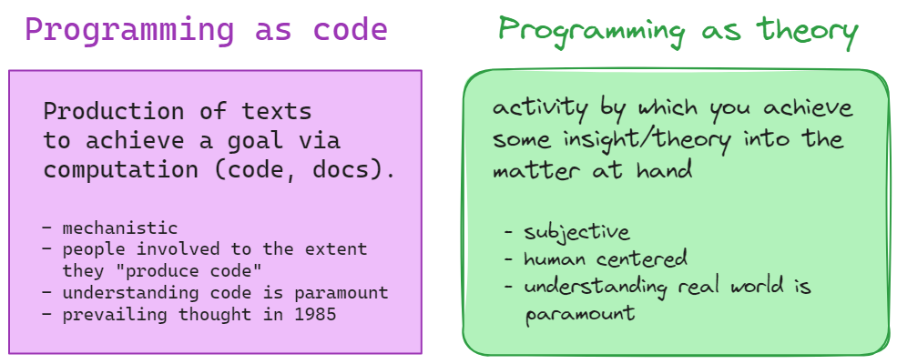

# What is a program?
- code
- documentation

_anything else?_

---
## Naur 1985: Programming as Theory Building

Programmig as defined in the article:
***"the whole activity of design and implementation of programmed solutions"***

Goal:
match significant part of activity in the real world to symbols manipulated by computers

_what if the real world activity changes?_

---

---

### Theory
Theory here is NOT the common interpretation of theory as the most abstract central tenet

Having a theory allows you to:
- support doing with explanations
- answer questions
- provide rationale/justification (argumentation)

Must be able to apply to reality; cannot simply follow rules (reality would give rise to anfinite rule set)

---
### Programmer's role
***Programming***: design & implementation of programmed solutions

***Theory***: knowledge and ideas of how real world affairs will be handled by programs

_What are programmers after?_

[***Programming*** as ***Theory***]

---
### What do programmers need to be able to do?
- explain _how_ the solution relates to real world issue 
  - _which parts of the real world are relevant?_

- explain the _why_ behind each part of the program
  - _which parts of the program match to which aspects of the real world?_

- **ability to respond to modification requests to support the real world in a new manner**
  - _how do you respond to changes in real world conditions?_

---
### Program Modifications

Modifications are  inevitable.

Reasons for modification:
- **insufficiency**: "a program, once in operation, will be found to be only part of the answer to the problems at hand"
- **inspiration**: program use can inspire ideas for further services

---
### Modification costs
Look at costs of various options
- revise existing codebase
- rebuild from scratch
- pre-plan and build flexibility into program

_which of these has the lowest cost?_

---
### All modification approaches are costly
- revise existing codebase
  - more than text manipulation; need understanding
  - not possible to understand theory based on code text and documentation
- rebuild from scratch
  - new theory required
- pre-plan and build flexibility into program
  - assumes predictability of future need
  - must be implemented, tested, etc. for cases that may never arise

---
### Modification Requirements

- "similarity determination": compare existing capabilities to new required capability
- need knowledge of the theory of the existing program
- beyond the scope of rules and criteria (cannot be prescribed)

---
### Evaluation of modifications 
- code correctness
  - does the code work? multiple avenues can deliver same functionality
- theory
  - does the code fit with the theory? fewer avenues that remain consistent with program theory
- comparison of potential paths (chosen solution vs. potential alternatives)
- extent to which programmers possessing the theory of a program remain in charge of it (_where else have we seen this?_)

---
### Modifications and program death
Death of a program happens on dissolution of the team possessing the theory of the program.

Dead progams can contiune to run  - the code may still execute.

Death becomes visible when modification demands cannot be intellegently addressed.

Theory must be rebuilt by a new team.

---
### Conclusions
- Push to elevate programming to much more than text manipulation.
- Respect for the humanity of programmers and the profession of programming as a highly creative and intellectual endeavor.
- Prioritize continuity of the theory (team continuity, passing down of knowledge, cross-training, etc.)

---
# Take heart!
- if you're feeling overwhelmed it's normal!
- software development is not about knowing all the commands and syntax
- human endeavor based on thinking about what you want to do and being able to articulate in plain language
- start with the smallest building blocks of syntax you know - can always optimize later!
- learning with support from others, we all have our own skillsets

---
### Reflection
- What are your thoughts on "programming as theory"?
- Does programming require this deeper connection between the real world and the program code?
- What are the most important skills for programmers to have? 
- Are expert python skills or creativity and understanding the context of real world problems more important? Does your answer differ for 1985 compared to 2020?

.md document on github to facilitate note-taking on your reflections:
https://github.com/damapak/ist303_spr2024/blob/main/WS_Programming_as_theory.md
