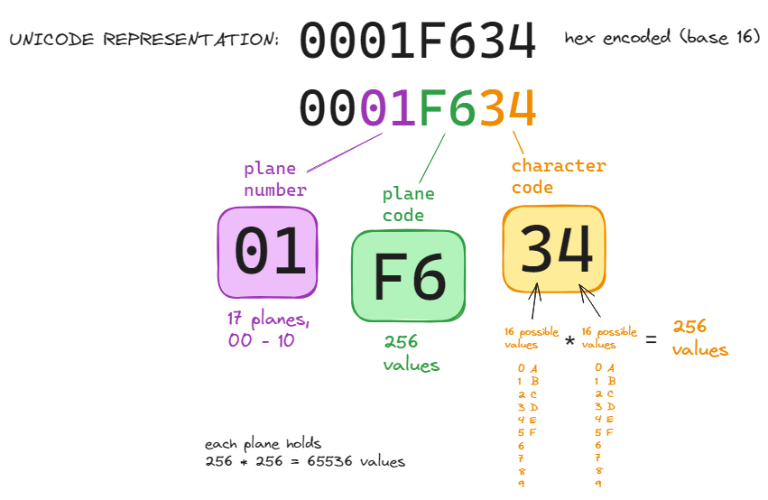
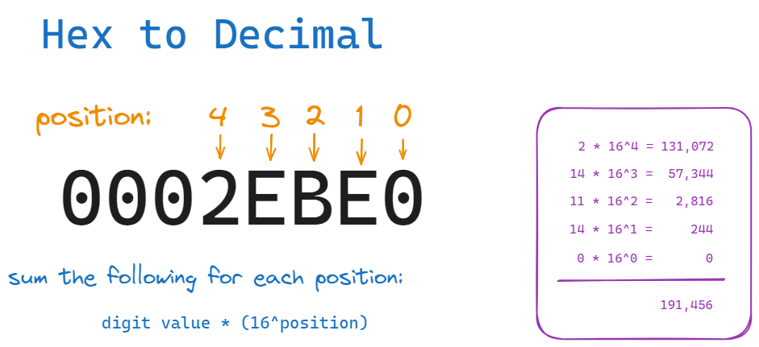
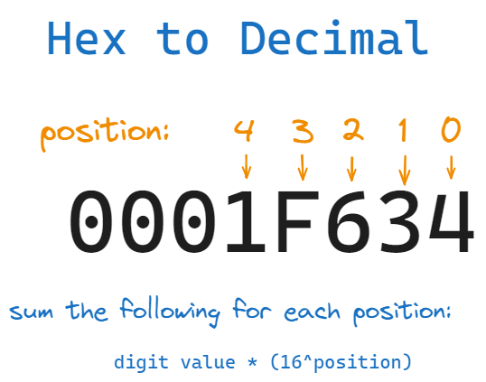
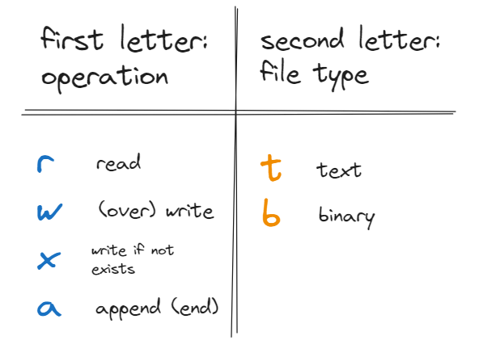
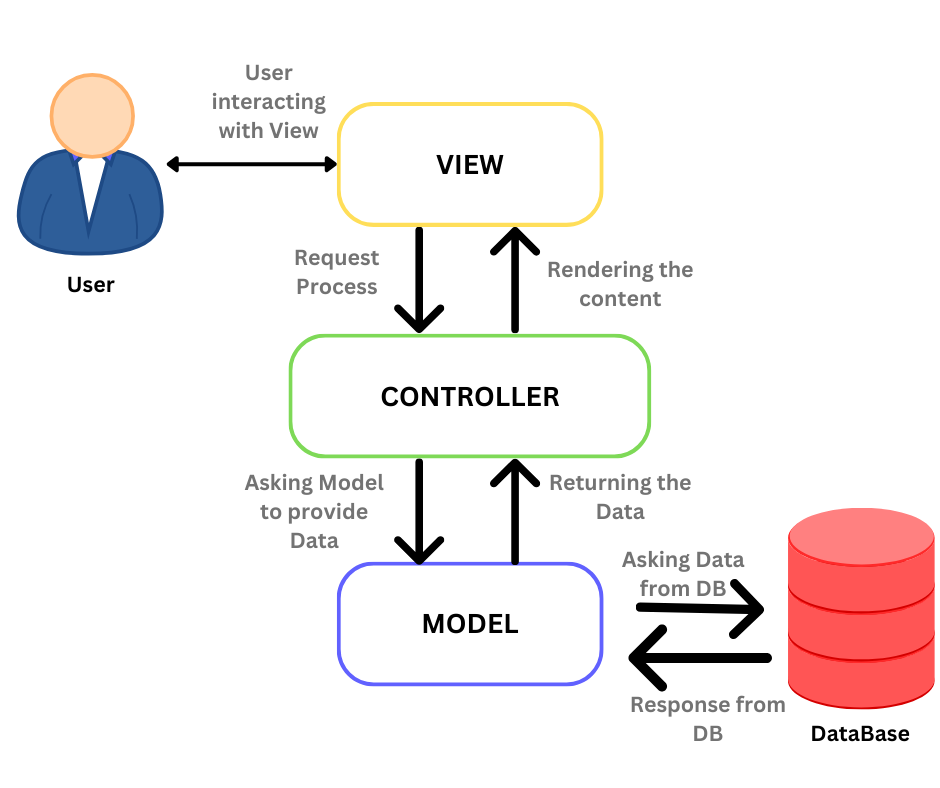

## Week 6 Agenda
- Flask assignment debrief
- Data Wrangling & storage
- Design patterns
- Midterm review (midterm next week)

---
## Check-ins

Flask assignment

From HN:
[Think Python, 3rd Ed](https://allendowney.github.io/ThinkPython/)


---
## Lubanovic Chapter 12: Wrangle and Mangle Data

Strings represented in python as unicode sequences (not byte arrays)

What is unicode?
- a standard that assigns a unique number to each character used in written languages
- currently has over 149K characters
- ASCII is the first 128 characters (backwards compatible)

---
## Text Encodings
- ASCII
  - 128 unique values (string.ascii_lowercase, punctuation, #'s)
- [UTF-8](https://en.wikipedia.org/wiki/UTF-8)
  - implementation of unicode, handles all 1,112,064 unicode points
  - use this when encoding
  - variable length
- Latin-1, cp-1252
  - use to decode (recommended to encode using UTF-8)

---
## Encoding and Decoding?
Unicode is the standard, the mapping of codes to characters

Encoding 
implementation of a standard, the specification for how character codes are converted to binary
- i.e. UTF-8
- storage of character set in bytes

Decoding
translation of bytes to character codes

---
## Unicode planes
- unicode divided into [planes](https://en.wikipedia.org/wiki/Plane_(Unicode))
- Plane 0 is the basic multilingual plane, all chars for most modern languages
- Plane 00 is ascii (128 chars, 7 bits, or 2^7 = 128 values)

---


---
## Python characters and unicode values
`import unicodedata`
- `'\u007a'` == `'\u007A'` == `'\U0000007A'` (backwards compatibility)
- hex characters (base 16: 0-9, A-F)
  - base char set (plane 0) accessed with \u followed by 4 hex chars: '\u0031'
  - extended char sets accessed with \U and 8 hex chars: '\U0001F334'
- hopefully don't do in class : '\U0001F634'

---
## Characters to bytes
bytes represented as decimal integers (0 to 255)
- encode method: `'sasquatch'.encode('utf-8')`
- bytes function (immutable): `bytes('sasquatch', 'utf-8')`
- bytearray function (mutable): `bytearray('sasquatch', 'utf-8')`
```
s = 'sasquatch'
b = bytes(s, 'utf-8')
slist = [x for x in s] #char list
blist = [x for x in b] #byte list
d = dict(zip(slist, blist))
print(d)
```

---
## Decimal/Integer to unicode character
All the unicode characters have a decimal & hex representation

Hex: '\u0023'

Decimal integer to character using chr() function:

```
chr(115)
chr(83)
```

_you saw this in the string exercise w/capital/lower sorting_

---
## Hex to Decimal
Seen:
- how Python represents characters using hex values
- how to go from characters to bytes (bytes, bytearray)
- how to get unicode character from integer value (chr())

What if you have a hex value and you want to get the integer (decimal) value?

- what is the integer value of '\U0002EBE0'?

---


---


can also convert using int function, int(str, base):
`int('0001F634', 16)`

---
## Hex and Integer comparison

Compare the value of the python unicode hex value with the converted integer value (using the chr function):
```
'\U0001F634' == chr(128564)
```

See what the unicode character is returned:
`chr(128564)`

---

## Displaying unicode characters in python
- python returns the text as a string for unassigned hex codes
- returns question mark inside a box if font does not support the character

```
'\U0002EBE0' # supported by my terminal
'\U0002EBE1' # not assigned
'\U0001FB35' # not supported by my terminal
```

---
## What does that have to do with software development?
- understand that there are different encoding schemes
- if you ingest/read external data you may need to deal with different encoding to make use of the data
- your program may feed into others and need a particular encoding
- especially important when dealing with binary
- the same is true for images (many more file extensions/formats there)

---
### Regular expressions
Regular expressions are a pseudo language for matching patterns in strings. 
- their own language, beyond python
- difficult to read
- powerful string search/matching functionality

---
### Regex in python
_re_ module in the standard Python library

Import with `import re` prior to using

---
### Re functions
- `re.search(pattern, string)`
  - returns a match object if the pattern is found in the string, otherwise returns None
  - access match object with `.group(0)`, i.e. `re.search(pattern, string).group(0)`
- `re.findall(pattern, string)`
  - returns a list of all matches in the string
- `re.sub(pattern, replacement, string)`
  - returns a string with all instances of the pattern replaced with the replacement string

---
### Example: Regex + string methods
In regex, 
  - [fg] returns matches for f or g
  - the + symbol returns 1 or more matches

The following regex statement equates to _'find one or more instances of any of the following characters that appear inside the brackets'_:
```
"[aeiohnpsty]+"
```

---
#### Example: coded message
for reference, from prior slide: `"[aeiohnpsty]+"`
1. import the re module: `import re`
2. assign the variable _coded_msg_ as shown below: \
`coded_msg = "cup fly turf hour nick seas dry"`
3. use the **re.findall()** function to return a list of _coded_msg_ characters that match the regex statement shown above step 1. Assign the result to a variable named `msg`
4. use the string join() method to concatenate the `msg` variable to depict a message (_hint: recall you can use an empty string `''` as the object of the join method_)

---


---
#### Resources to learn more about regular expressions (regex):
  - [python docs](https://docs.python.org/3/library/re.html)
  - [datacamp cheat sheet](https://www.datacamp.com/cheat-sheet/regular-expresso)

---
# **Lubanovic Chapter 14: Files and Directories**


---
## Writing to files
Seen previously how to do this in terminal:

- echo "sometext" > file.txt
- touch file1.txt # mac/linux only
- new-item file1.txt # powershell only

---
## Python open function
open and edit files from within Python scripts (or interactive session) using the "open" function

Need to open a file to:
- read from it
- create it / overwrite existing
- add to it

format: `fil = open(FILENAME, MODE)`
_where mode is a string_

---
## Mode (python open function)
supports up to two characters: 


---
## Open example: read a file
```
file = open('file.txt', 'rt') # manually open 
data = file.read()
file.close() # manually close
```

This will load all the contents of the file at once

---
## Writing files
write method of file objects:
```
filobj = open('test.txt', 'wt') # create file in overwrite mode
filobj.write("This is the first line")
filobj.close()
```
append to the file:
```
filobj = open('test.txt', 'at', encoding = "utf-8")
filobj.write('\n\U0001F634')
filobj.close()
```

---
## Using the "With" statement to open files
Using "open" within a with statement automatically closes a file when the block of code is exited.
- don't need file.close() - eliminates resource leaks, code more readable
- error handling - with statement ensures that the file is closed properly if it encounters an error (could remain open with an error in the manua method)
```
with open('somefile.txt', 'r') as file:
    data = file.read()
```

---
## Getting contents of a file as a variable:
## Slurp with **read()**

Get all contents (in memory) at once, using **read** (returns a single string object):
```
with open('test.txt', 'rt', encoding = 'utf-8') as fil:
  data = fil.read()
```
---
## Getting contents of a file as a variable:
## Iterate over a line with **readline()**

```
data = ''
with open('test.txt', 'rt', encoding = 'utf-8') as fil:
  for i in range(4):  # range extends past file length    
    data += fil.readline()
```

---
## Getting contents of a file as a variable:
## Create a list of lines with **readlines()**
Using **readlines()**
```
with open('test.txt', 'rt', encoding = 'utf-8') as fil:
  data = fil.readlines()
```
readlines reads one line at a time, appending each line into a list of strings

---
## Getting contents of a file as a variable:
## **Roll your own**

Iterate over the lines in the file (concat as a string in this ex):
```
data = ''
with open('test.txt', 'rt', encoding = 'utf-8') as fil:
  for line in fil:
    data += line
```
Could create any data type, add criteria for creating your data, etc.

---
## Other file operations
Check if a file exists: `os.path.exists('path')`
```
import os
os.path.exists('test.txt')
```

Check if something is a file: `os.path.isfile()`
```
os.path.isfile('test.txt')
```

Can also check if something is a directory with `os.path.isdir()`

---
# Other file operations, cont'd
Copy files
```
import shutil
shutil.copy('test.txt', 'testcopy.txt')
```

Rename files
```
import os
os.rename('testcopy.txt', 'im_a_new_name.txt')
```

---
## Search directory for files
Glob module

Similar to regular expression matching, but much simpler syntax and ruleset. ! is 'not' operator, ? matches any single character.

match any file in the directory:
`import glob`
`glob.glob('*')`

match filenames containing a 't': `glob.glob('*t*')`
match filenames containing 'tr' or 'te': `glob.glob('*t[er]*')`


---
# Lubanovic Ch. 16: Data in a box - persistent storage

---
## Delimited files
csv (comma separated values)
- come in other flavors, i.e. tab delimited ('\t'), '|' delimited
- first row may have column headers
- values in a 'field' may contain escape characters; can be dealt with either with outer enclosure in quotes, or escape characters

python has a csv module
`import csv`

---
## Create a file

ken.py

---
## Read the file
read the file with **csv.reader()**:
```
with open('kenblogs', 'rt') as fil:
  c = csv.reader(fil)
  kenblogs = [row for row in c]
```
read the file with **csv.DictReader()**:
```
with open('kenblogs', 'rt') as fil:
  c = csv.DictReader(fil, fieldnames=['first', 'last', 'postids'])
  kenblogs = [row for row in c]
```
---
## Object persistence
Saw how to read/write to delimited, text files. 

What if you want to store your objects directly, not as text?

---
## Writing objects to files, and back again
Shelve library (extends the pickle library)
- Stores objects directly, re-imported as objects
- don't have to worry how data will import (lists, strings, etc)
- quick way to persist objects

Drawbacks:
- security risk of executing arbitrary code
- not a database replacement 

---
## Shelve example
Shelve for later:
```
d = {"name":"not Ken", "posts":[23,34]}
import shelve
with shelve.open('myshelf') as db:
  db['myobj'] = d   #write object 'd' to 'myshelf' file
```
Delete, then retrieve the object from file
```
del d #delete the d object
with shelve.open('myshelf') as db:
  d = db['myobj']
```

---
## Other data organization schemas
The book touches briefly on dynamically structured documents (no predefined schema other than formatting rules):
- XML
- JSON
- YAML

There are Python libraries to manage interaction with all these document formats

---
## Data science / transformation / processing
Pandas library
- for ingesting and manipulating data
- similar to the R programming language
- heavy focus on vectorized operations
- more functional approach to programming 

---
## We saw how to
- write object contents to text files
- store objects directly

what about communicating with databases?

---
# Connecting to Relational Databases
Python has a standard API for accessing relational databases, DB-API. Contains the following abstractions to operate regardless of your db choice:
- **connect()**: connect to a database (create if doesn't exist)
- **cursor()**: create a cursor object to execute queries (created from connection object like connection.cursor())
- **execute()** and executemany(): execute SQL commands against the database (executed from cursor object, cursor.execute())
- manage result set: **fetchall()**, **fetchmany()**, **fetchone()**

---
## SQLite
DB-API extended/used by the various relational database libraries
**sqlite** used in the Flask part 3 exercise

Saw this two ways in the assignment:
- creating a connection and then using 'with open' to execute a database creation script (schema.sql script) 
- creating a connection function and using it to create a cursor to execute relevant database CRUD operations based on user actions (create, read, update, delete)

---
#### Running a table creation script (init_db.py file)
```
import sqlite

connection = sqlite3.connect('database.db')

with open('schema.sql') as f:
  connection.executescript(f.read())

cur = connection.cursor()

cur.execute("INSERT INTO posts (title, content) VALUES (?, ?)",
            ('First Post', 'Content for the first post')
            )

connection.commit() 
connection.close()
```

---
## Cursor and SQL query format
```
cur = connection.cursor()

cur.execute("INSERT INTO posts (title, content) VALUES (?, ?)",
            ('First Post', 'Content for the first post')
            )
```
- commit needed with CREATE, INSERT, UPDATE, DELETE (edit commands)
- Sql statement is a single string
- (title, content) are the column names (defined in the schema file)
- the (?, ?) within the query are values not yet known, defined as a tuple immediately after to avoid sql injection attacks

---
## CRUD: read
```
import sqlite
conn = sqlite3.connect('database.db')
conn.row_factory = sqlite3.Row

posts = conn.execute('SELECT * FROM posts').fetchall()
conn.close()
```

- no commit
- conn.row_factory creates customizable cursor, in this case sqlite3.row creates a dictionary cursor (key access instead of offset)
- default cursor returns each row as a tuple

---
## CRUD: update
```
import sqlite
conn = sqlite3.connect('database.db')
conn.row_factory = sqlite3.Row


conn.execute('UPDATE posts SET title = ?, content = ?'
            ' WHERE id = ?',
            (title, content, id))
conn.commit()
conn.close()
```

---
## CRUD: delete
```
import sqlite
conn = sqlite3.connect('database.db')
conn.row_factory = sqlite3.Row


conn.execute('DELETE FROM posts WHERE id = ?', (id,))
conn.commit()
conn.close()
```

---
## Other SQL flavors in Python
- MySQL
- PostgreSQL

SQLAlchemy: 
- extends DB-API, allows connections to the various flavors of SQL
- Works at a layer of abstraction higher than the other sql libraries
- has an ORM (Object relational model) that tightly integrates application code and relational data structures

---
ORM provides the plumbing to connect these two houses:


---
## For More SQLAlchemy

[flask & database connection using SQLAlchemey](https://python-adv-web-apps.readthedocs.io/en/latest/flask_db1.html) 

---
### Document and Object storage
Document databases
- Various NoSQL databases (pp 340-341 in Lubanovic)

Object-oriented databases - like document store, but for objects
- [MongoDB](https://www.mongodb.com/databases/what-is-an-object-oriented-database)

---
# Design Patterns
"Design Patterns: Elements of Reusable Object-Oriented Software" (1994)


Erich Gamma, 
Richard Helm, 
Ralph Johnson, 
John Vlissides


---
## GoF: Types of patterns
- **Creational**: patterns that create objects, rather than instantiating directly. Control which and how objects are created.
- **Structural**: class and object composition. Use inheritance to compose interfaces and define ways to compose objects to obtain new functionality.
- **Behavioral**: how objects behave, primarily related to communication between objects.

[wikipedia page](https://en.wikipedia.org/wiki/Design_Patterns)

---
##  GoF Examples

_Creational_: **Builder** pattern to separate construction and representation

_Structural_: **Decorator** pattern to dynamically override behavior in an existing method of an object (pytest, flask routes, etc.)

_Behavioral_: **Observer** pattern to implement publish/subscribe functionality, where any # of observer objects can see an event

---
builder pattern example

separation of construction and representation

[builder.py](test_dir/builder.py)

---
## Decorator pattern
- flask routes
- pytest markers

---
## Observer pattern
implement publish/subscribe functionality, where any # of observer objects can see an event

kenob.py

---
## Architectural Digest: MVC
Model: data required to be displayed in the View. Collection of classes that describes the business logic (business model and the data model). The code that "does stuff"

View: UI components (HTML, CSS, etc.); displays data received from controller

Controller: processes incoming requests. Sends user data to Model, passes results to View


[source](https://medium.com/@ankit.sinhal/mvc-mvp-and-mvvm-design-pattern-6e169567bbad#)

---


---


---
## MVC 
What does this architectural pattern have in common with many design & architectural patterns?

- separation of responsibility
- logical organization of codebase into parts that can be independently worked on, do not require changes to each other (or minimal)
- Changes to your business logic should only affect one area of your codebase (in this case the models)

---
# More resources: Design Patterns
- [design patterns in python](https://refactoring.guru/design-patterns/python)

Videos
- [10-min introduction to 8 DPs](https://www.youtube.com/watch?v=tAuRQs_d9F8)
- [web app patterns](https://www.youtube.com/watch?v=I5c7fBgvkNY)

---
## Additional design considerations
SOLID design principles:
- Single Responsibility Principle
- Open-Closed Principle
- Liskov Substitution Principle
- Interface Segregation Principle
- Dependency Inversion Principle

---
## SRP - we've seen this before
- Single Responsibility Principle: A class should have only one reason to change; it has only one job or responsibility.

---
## Open-closed
Software entities (classes, modules, functions, etc.) should be:
- open for extension
- closed for modification
- the result is that you can add new functionality without changing the existing code

---
## Liskov Substitution Principle
Functions that use references to base classes must be able to use objects of derived classes without knowing it or having it alter the behavior of the program.
- if you overwrite a function in a subclass it must accept data that the parent class function does so that it is indistinguishable
- superclass objects can be replaced with subclass objects and function properly without undesired effects
- derived classes only extend (see open-close principle)

---
## Interface Segregation Principle
Clients should not be forced to depend upon interfaces that they do not use.
- a class or module should not depend on methods or properties it doesn’t need
- split software into multiple, independent parts 

---
## Dependency Inversion Principle
High-level modules should not depend on low-level modules. Both should depend on abstractions.

- decouple high-level and low-level modules
- they both depend on the same abstraction/interface
- editing low-level modules should not necessitate changes to high-level modules


---
## SOLID Goal'd
Seeks to:
- provide a way to decouple software modules in an effective way
- make software easier to understand, maintain, and extend

