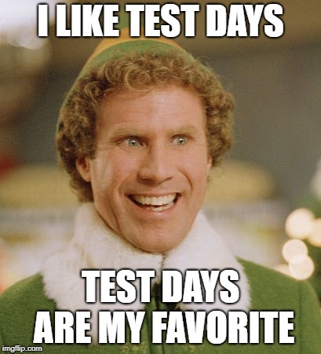
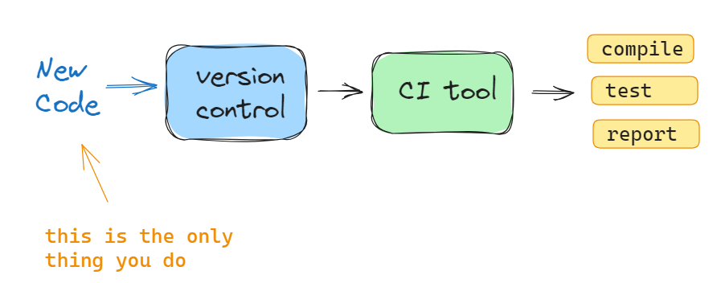

## Week 9 Agenda
- Spring break
- Resources/Cool stuff
- Team projects
- Lecture
- In-class team assignment (due @ 10:15)

---


---
# ACM Resources
**ACM = Association for Computing Machinery**

#### ACM Digital Library:
[Announcement: ACM 1951-2000 free access](https://www.acm.org/articles/bulletins/2022/april/50-years-backfile)
[ACM digital library](https://dl.acm.org/)

#### CACM: Communications of the ACM
[Announcement: Now open access](https://cacm.acm.org/news/cacm-is-now-open-access-2/)
[CACM site](https://cacm.acm.org/)

---
# Cool stuff
Ever wanted to send a message to the future?
[Timelock](https://timelock.dev/)

[Robot employees](https://www.pcmag.com/news/mercedes-hires-humanoid-robots-work-at-its-factories)

[Check for human-ness](https://r-u-human.com/)

---
# Team Projects

**Great job on the presentations!!**
Graded, incl. peer feedback summary

Be on the lookout for a message in your canvas group page from your "client"

Team projects due 4/17

---
# P & M Ch 7: Testing and Continuous Integration



---
### Things will inevitably go wrong...

- code changes
- dependency changes
- load changes
- inscrutable bugs
- almost any reason you can imagine

---
Can't control or predict all of those factors...Control your approach!

#### Three ways to view your codebase:
1. **User**
    - 1,000 ft view
    - functionality
2. **Tester**
    - see some internals
    - database, connections, memory
3. **Developer**
    - EVERYTHING (coding, design, theory)

---
### Black-box testing: Outside
- only functionality is visible
- user input validation
- output
- state transitions
- edge cases

Looking at the ISS from outside

---
### Grey-box testing: Some guts
- auditing and logging
- intermediate data
- communication with other systems
- system-added information
- other cruft lying around

Walking around the inside of the ISS

---
### White-box testing: the Matrix
- testing all branches of code
- error handling (safe handling, proper messaging, etc.)
- working as documented
- testing code with other code

Hooked up to a terminal within the ISS

---
### Don't need to wait for changes to break things
- build up a suite of tests
- control when/which tests get run
- automate with a testing framework

---
### Continuous Integration
Comprised of:
- version control
- automated builds
- automated tests



---
# Having tests guarantees everything will work!


---
# Not quite...
- working code may not be what the customer wants
- Automated tests may not work as well for some aspects (UI)
- which tests to write?
- how much of your code is tested? (code coverage)

---
# Be Prepared
- good testing takes time
- testing code is code to write (should be included when calculating work time)
- 100% coverage not practical, aim for 85%+
- Monitor rate of bugs, esp before/after release

---
# P & M Ch 8: Test-Driven Development

I used all my testing memes back in week 5 :(

check https://devhumor.com/ if needed

---
## TDD: process overview
- determine a task to work on
- write a test that your code would have to pass in order for it to accomplish the task
- write minimum code needed to pass the test
- refactor if needed
- ...start the process again

---
## TDD 
**RULE #1:** your test should always fail before writing code
**RULE #2:** implement the simplest code possible that will pass the test

YAGNI - "You ain't gonna need it"

Process: 

`RED` -> `GREEN` -> `REFACTOR`

---
## TDD Principles
- create tests (then code) for specific functionality
- anything beyond that functionality is not important
- each test should verify one thing
- keep test code organized
  - avoid duplicate tests
  - mirror your code structure 
  - keep test code separate from code
- once tests pass, move on

---
## TDD & Code Dependencies
- Not always able to code just one piece of code
- in TDD, other code may not exist yet (for example if it wasn't needed to satisfy existing tests)
- writing minimal code to satisfy tests does not include all the other supporting code

---
## TDD & Code Dependencies, cont'd
How to deal with your task if it has dependencies?
- loosely couple your code (reduce level of dependency)
- mimic functionality that other code would have
- "fake" objects / database connections
- temporary solutions

---
## Strategy pattern
- multiple implementations accessible through a single interface
- in TDD, can use one for testing, one for production code

---
Ex: db connection
```
class Database:
  def connect(self):
    pass

class TestDatabase(Database):
  def connect(self):
    return "Connected to test db"

class ProductionDatabase(Database):
  def connect(self):
    return "Connected to prod db"

db = TestDatabase()
db.connect()
```

---
## More tests means more code
- automated TDD requires a LOT of test code
- can save some time with mock objects

Seen these before - Fixtures in pytest (**test_pe3.py**):
```
#fixture for creating Account objects
@pytest.fixture()
def create_objects():
    a = BankAccount("X Abc", 1234, datetime.date.today(), 500)
    b = CheckingAccount("X Abc", 1234, datetime.date.today(), 500)
    c = SavingsAccount("X Abc", 1234, datetime.date.today(), 500)
    return [a, b, c]
```

---
## Good software is testable
- try for relatively complete coverage
- use automated tools
- refactor to improve code
- don't write unnecessary tests

---
## Common pitfalls
- partial adoption (some members of team)
- poorly maintained test suite
  - can result in unnecessarily long running times
- the abandoned test suite (i.e. seldom or never run)
  - poor maintenance
  - turnover

source: https://www.agilealliance.org/glossary/tdd/

---
# Janzen & Saiedian (2005)
-

## Test-Driven Development: Concepts, Taxonomy, and Future Direction
-

---
## TDD is more than testing
- write automated tests of the "units" of the code
- unit tests are written as code and placed in a testing framework
- mock/stand-in objects and functionality to support unit tests
- traditional testing is done after code is written (can be much later, possibly by someone other than developer)
- with TDD, developer writes tests before the code

---
## TDD is more than testing, part 2
- it is NOT a testing technique (i.e how to write tests)
- it is NOT a software development methodology
- it is a practice that can be used along with others
- drives analysis, design, and programming
- tests are kept after they have been passed

---
## Research Results
Paper presents outcomes from:
- 3 industry studies
- 5 academic studies

**CODE QUALITY**: 4/8 (50%) show improvement in test passing, defects, reuse, or information flow

**PRODUCTIVITY**: 6/8 (75%) show improved or similar productivity to non-TDD

---
## Prep for in-class exercise

Week 5 covered testing...**that was a month ago!!**

We'll do a quick refresher

---
## Anatomy of a test: Arrange, Act, Assert

**Arrange**: set up the conditions for the test

**Act**: call some function or method

**Assert** that some end condition is true
- syntax: `assert CONDITION`

---
### Basic test writing (Pytest compatible)
- write regular python code
- name your functions with the "test_" prefix
- name your test files with "test_" prefix or "_test" suffix
- use python's _assert_ keyword along with your condition

```
def test_permapass():
  assert 1 == 1

def test_permafail():
  assert 2 > 300
```

---
## Use fixtures to manage mock objects
Fixtures are functions that can be passed in to your test functions - can create test objects, data, or state setup for use in tests

- create with decorator @pytest.fixture, followed by function def
- used in a test function by passing the fixture as an argument
```
import pytest
@pytest.fixture
def example_fixture():
    return [32, 100]

def test_with_fixture(example_fixture):
    assert example_fixture[0] == 32   # this will be True
```

---
## Pytest markers
**xfail**: use to indicate a test that SHOULD fail
```
import pytest

@pytest.mark.xfail(reason="Reason of failure")
def test_example():
    assert 0 == 1
```

**skip**: `@pytest.mark.skip`

view all markers (buitin): 
pytest --markers