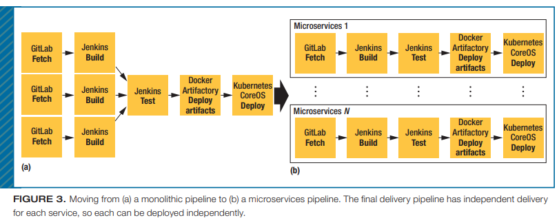
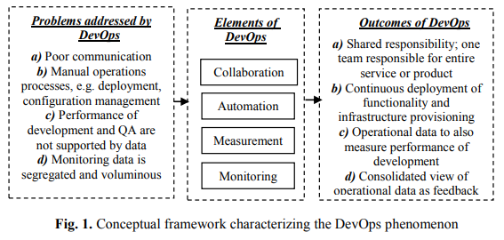
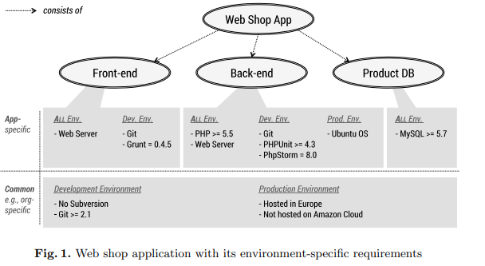

# Week 11 Agenda: Formalizing Agile
- P & M Ch 12
- CI/CD
- DevOps
- Articles
- CI in action
- Lubanovic Ch 17

---

#### P & M Ch 12: The Real World: Having a Process in Life

There is no single process that will work for all situations

But, there are things that good processes have in common...

---
### Indicators of a good process
1. Develop iteratively
   - numerous empirical examples: waterfall production far riskier
   - do not wait on that "one key piece" of functionality - simplify it and develop other areas of the software
2. Continual evaluation and assessment
   - project will change
   - requirements will change
   - people will often change
   - evaluate your processes and be willing to adjust as needed

---
### Indicators of a good process, cont'd
3. Incorporate best practices
   - be aware of what is available and how it could benefit (or hinder) your project
   - be fair in your assessment of how different methods/processes will affect **the project at hand**

---
### How to make changes
When you decide you need to make a change, some things to think about:
- be mindful of **when** you are making changes
   - avoid changing mid-iteration: more disruption than benefit
   - end of an iteration is a natural time for adjustments
- have a way to **measure** if your changes help
  - measure at the end of an iteraation
  - use concrete measures: test coverage, bug counts, velocity, stand up meeting durations, etc.

---
### How to make changes, cont'd
- value all the **members** of your team
   - "no process can overcome bad people, but good people can overcome a bad process"
   - try for consensus as much as possible
   - value team opinions in considering changes

---

# The End (Pilone & Miles):

## What are your thoughts about the text? 
(level of complexity, usefulness/helpfulness in your team programming experiences, relevance)

---
## CI and CD
**Continuous Integration**: describes the use of automated processes in the development of software where all changes are managed, monitored, and tested automatically (**DEVELOPMENT**)

**Continuous Delivery**: expands the use of automated tools to the deployment, operation, and monitoring of software (**OPERATION**)

---
### DevOps: Production (Dev) + Deployment (Ops)

Production/Development:
- Plan
- Code
- Build
- Test
- Release

[Amazon's definition of DevOps](https://aws.amazon.com/devops/what-is-devops/#:~:text=DevOps%20is%20the%20combination%20of,development%20and%20infrastructure%20management%20processes.)

---

---
Sample stack:

---
### Readings
- Balalaie & Jamshidi, 2015
- Chen 2015 
- Lwakatare et al 2015 
- Wettinger et al 2015

---
## Balalaie & Jamshidi, 2015 
### What they looked at:
Reported on experiences migration and refactoring of mobile back end to microservices architecture

**microservices architecture**: _cloud-native architecture that aims to realize software systems as a package of small services_

---
## Microservices
Each service:
- is independently deployable on a different platform/ technological stack
- can run its own processes
- can communicate with each other via API (REST or RPC, [read about the differences here](https://aws.amazon.com/compare/the-difference-between-rpc-and-rest/))
- is developed by a small team

---
## Migration details
- migrated a relational database as a service to microservices
- deployment was done manually
- motivating use case: user on-demand chat

---

---
### Lessons learned
|Problem |Solution|
|--------------|------------------|
|deployment in development environment was difficult: dependent services must also be deployed | put samble deployment descriptions in each file |
|service contracts: changing services that only expose contracts to each other was brittle| tolerant reader design pattern to add gradeful handling
|distributed system development needs skilled developers|have team members familiar with type of programming needed|

---
### Lessons learned, cont'd
|Problem |Solution|
|--------------|------------------|
|service development templates are key| use templates with samples of correct implementation reviewed by senior developers|
|microservices not a silver bullet - introduce complexities that can require much effort|made sense for their use case

---
## Chen 2015: _Continuous Delivery: Huge Benefits, but Challenges Too_

#### What they looked at:
Reported on experiences with adoption of CD, including benefits and challenges in a bookmaking company (book as in "bookie", not publishing)

**continuous delivery**:
_software engineering approach in which teams keep producing valuable software in short cycles and ensure that the software can be reliably released at any time_

---
## CD pipeline
- **Code commit**: on check-in, compiles code and executes unit tests
- **Build**: execute unit tests (again), generate code coverage report, run integration tests and static analyses, builds artifacts for use in subsequent stages
- **Acceptance test**: ensure software meets user requirements. Create production-like envt: server config, software deployment and configuration, run acceptance test suite
- **Performance test**: gauge how code changes affect performance
- **Manual Test**: exploratory, business user tests
- **Production**: deploy into production

---
## Benefits
- faster time to market
- building the "right" product (feeedback happens quicker w/automated processes & deployment)
- improved efficiency: eliminates time needed to manually configure environments 
- reliable releases
- improved quality (open bug reports dropped by 90%)
- improved customer satisfaction

---
## Challenges
- fit with existing business processes
- limited out-of-the-box solutions, need time and resources to set up
- avoiding vendor lock-in
- applications not amenable to CD

---
## Lwakatare et al 2015: _Dimensions of DevOps_

#### What they looked at:
Sought to characterize the elements of DevOps using a literature survey and interviews with practitioners (searched 6 databases for "DevOps", most were from ACM digital library; also incl Science Direct)

**DevOps** _seeks to extend collaboration of development towards operations, which is responsible for deploying, managing and supporting systems’ performance_

---

---
#### Wettinger et al 2015: _Enabling DevOps Collaboration and Continuous Delivery Using Diverse Application Environments_

**What they looked at:**
How to specify and maintain diverse application environments in DevOps, including those with environment-specific requirements

**Continuous delivery** _Continuous delivery aims to significantly shorten software release cycles by bridging existing gaps between developers, operations personnel (system administrators), and other parties involved in the delivery process_

---

---
#### Recommendations
Using the motivating example shown in the diagram, how to arrive at a suitable topology? _AER = application environment requirements_
1. Define constraints that express your preferences for non-functional requirements, i.e. 'resilient' for production environments and 'minimum resource usage' for development environments 
2. Compare against common requirements and look at the knowledge base of topologies for potential solutions
3. Rank the topologies according to your environment preferences
4. Pick a (or the most) suitable topology

---
## Discussion of Readings

2 readings of each type with the same DevOps focus: 
- business use case/experiental lessons learned
- academic/theoretical explorations of DevOps

---
## Question #1 
.
## Which type did you find more useful?

---
## Question #2:
.
## Would the answer differ if we were looking at a technical component of computing (say cryptographic protocol)?

---
## Continuous Integration (CI)
Production/Development:
- Plan
- Code
- Build
- Test
- Release

---
## Continuous Integration in "Action"

Explore CI using Github actions

Goal is to automate the "Dev" side of things:
- Code changes
- Build
- Test
- Release

---
## Automate with CI: Code changes

We've covered this one extensively

This is done using version control and for the purposes of this course git and github specifically

---
## Automate with CI: Build 

We haven't previously discussed build scripts

**Build scripts** configure a project, typically a library or an application; specifies dependencies, repositories, any other settings, and produces artifact(s) or package(s) for later deployment. 

---
## Build script: typical contents
- **Fetch Code**: get the latest code from the source control repository
- **Compile code**: compile the code, check the dependencies/modules
- **Unit Tests**: automated unit tests are run
- **Linking**: libraries and code files are linked as needed
- **Build Artifacts**: artifacts (like executables or binary files) are built and stored and/or deployed
- **Logging**: logs generated during the build process are archived

---
## Build characteristics 
- build scripts are like snowflakes: each one is a little different
- typically involve getting code from a source code repository and running a tool to compile and test the code
- used to primarily result in a compressed archive (.ZIP, .TAR.GZ) or executable (.EXE, .BIN, .APP, etc.); increasingly results in a thing to be done, i.e. deployment of a web application.

---
## Builds in the team projects
For purposes of this course, we will focus on: 
- fetching the latest code
- checking and installing dependencies
- running tests

---
## Additional exercises to hone your skills (artifact creation):
Create installable packages
- Okken appendix 4: build a python package

Deploy a flask app using free hosting
- [using render](https://docs.render.com/deploy-flask)
- [flask docs](https://flask.palletsprojects.com/en/2.0.x/deploying/)

---
## Finding and installing dependencies
With a virtual environment activated:

`pip freeze` lists all the Python packages you have installed in the current environment, along with version number

`pip freeze > requirements.txt` will pipe the results of the _pip freeze_ command to a requirements.txt file in your project folder
- this is what you will use in gh actions to specify the dependencies
- can open & edit as needed (remove unnecessary dependencies or revise version info)

---
## INTERACTIVE
For the remainder of the CI material:
- follow along in your local team project repository
- identify someone in your team to push the changes or make them directly in github (or coordinate taking turns, or do it later)

---

### Requirements.txt
If you don't already have a **requirements.txt** in your team repo, go ahead and create one with `pip freeze` on your local machine

Open and edit it until satisfied, communicate with your team and have someone push/create it to your team github repo

---
## Directory structure

project/
|.gitignore
|**requirements.txt**
|main.py
|README.md
|templates/
|static/
|...

---
## Automate with CI: Testing
Github actions can run test scripts (execute Pytest), but we need to have a test structure in place

to automate testing, we need to have:
- function/unit tests
- structured test code (directory)

---
### Testing Structure (Pytest)

For each test directory and subdirectory, you need to have an `__init__.py` file (empty file). This prevents issues if two test files have the same name.

Go ahead and create a _tests_ directory in your main project directory. Add an empty **__ init__.py** file in your _tests_ directory.

If you already have a solid test structure that mirrors your codebase structure and have testing scripts you are happy with you do not need to restructure your repo.

---
## Directory
project/
|...
|tests/ 
||--__ init__.py 
||--test_unit.py 
||--test_func.py 

---
## Tests folder
This folder is where you will keep all your tests. You can write/migrate your existing tests here.

---
### Automation with Github actions
- you have your dependencies stored in a requirements.txt file
- you have your test code structured and organized

Now we're ready to set up our first github action!

---
## Github actions are stored in YAML files
[YAML ain't markup language](https://yaml.org/)

YAML is similar to JSON, but more _pythonized_ (indented, with colons :)

Can store data or config files

---
## Configure your repo for Action
- in the main project directory, add a **directory** named _.github/_
- within that dir, add a directory named _workflows/_
- within the _.github/workflows/_ directory, add a YAML file (name it whatever you want, i.e. 'actions.yml')

Go ahead and have someone make that change in your team repo

---
## Where to put your .yml
project/
|.github/workflows/
|||--actions.yml
|.gitignore
|main.py
|requirements.txt

Your repo is now configured to use github actions

---
## What are Github actions?
Github actions are actions that are triggered by a specified event (repo push, pull request, time-scheduled, etc.) and executed within a github-created environment

GH free tier: 2,000 minutes of actions/month

---
## Features of actions

Actions:
- follow the cycle of `event -> create container -> execute action`
- they create container(s) built to your specifications and execute the code within that environment
- do not change anything in your repository by default (they are not operating in the repo environment)
- run history available in the 'Actions' section of your repo

---
## Defining actions
- `on:` defines the triggering event(s)
- `jobs:` contain named entities that define what OS to run on and the steps to execute
- each step has a defined name and associated properties (code to run or which built-in actions to use)
- can make use of pre-existing actions (checkout repo code, setup python, etc.)

---
## Example YAML
the course github has a sample .yml file configured to test the 'observer.py' file in the _scripts_ dir

[sample yml](.github/workflows/actions.yml)

---
## Run history

[history of actions in course github](https://github.com/damapak/ist303_spr2024/actions)

---
## Making a change and pushing it
We've reviewed the details of a successful test run, now we'll change the observer_test.py so that a test fails

[observer_test file](scripts/observer_test.py)

now we'll push to github and watch the action run

---
## Go forth and create/migrate your tests to that they will auto-run!!
