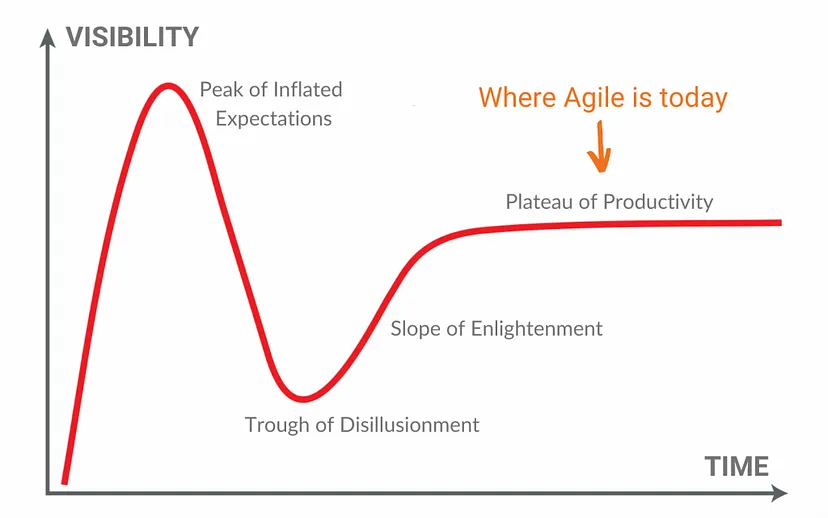
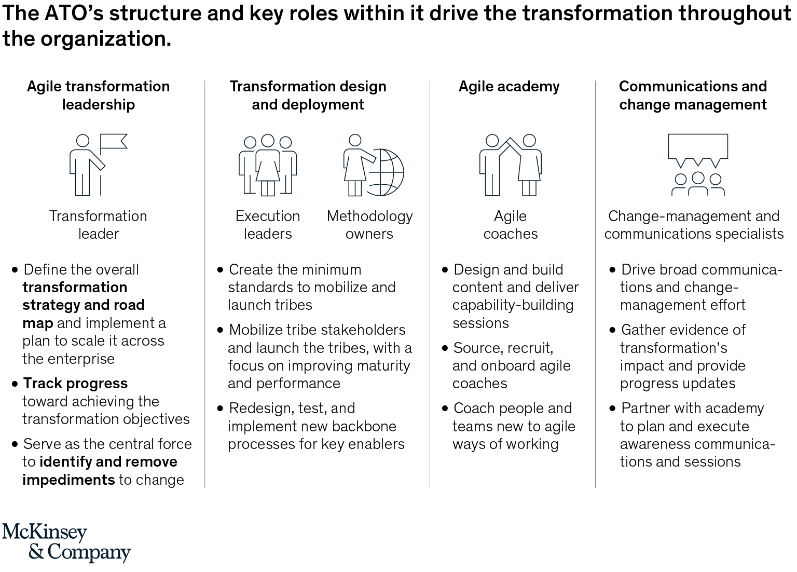
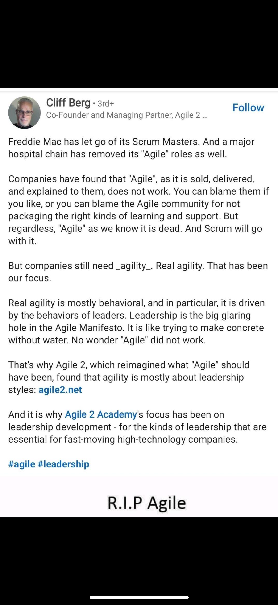

# Week 12 Agenda
- Agile revisited
- In-class assignment
- Team time

---

---
### [2001: Agile manifesto](https://agilemanifesto.org/)

Left hand side >> Right hand side:

***Individuals and interactions*** over processes and tools 

***Working software*** over comprehensive documentation 

***Customer collaboration*** over contract negotiation 

***Responding to change*** over following a plan

---
### [Principles of Agile #1-4](https://agilemanifesto.org/principles.html)
- Our highest priority is to satisfy the customer through early and continuous delivery of valuable software.

- Welcome changing requirements, even late in development. Agile processes harness change for the customer's competitive advantage.

- Deliver working software frequently, from a couple of weeks to a couple of months, with a preference to the shorter timescale.

- Business people and developers must work together daily throughout the project.

---
### Principles of Agile #5-8

- Build projects around motivated individuals. Give them the environment and support they need, and trust them to get the job done.

- The most efficient and effective method of conveying information to and within a development team is face-to-face conversation.

- Working software is the primary measure of progress.

- Agile processes promote sustainable development. The sponsors, developers, and users should be able to maintain a constant pace indefinitely.

---
### Principles of Agile #9-12

- Continuous attention to technical excellence and good design enhances agility.

- Simplicity--the art of maximizing the amount of work not done--is essential.

- The best architectures, requirements, and designs emerge from self-organizing teams.

- At regular intervals, the team reflects on how to become more effective, then tunes and adjusts its behavior accordingly.

---
## 2014: Agile is Dead
Dave Thomas, one of the original signatories of the agile manifesto penned [Agile is Dead, Long Live Agility](https://pragdave.me/thoughts/active/2014-03-04-time-to-kill-agile.html)

- Argued that "agile" use had moved to the right (referring to the original manifesto that valued the items on the left)
- develop with "agility"

---
"Having conferences about agility is not too far removed from having conferences about ballet dancing, and forming an industry group around the four values always struck me as creating a trade union for people who breathe.

And, unfortunately, I think time has proven me right. The word “agile” has been subverted to the point where it is effectively meaningless, and what passes for an agile community seems to be largely an arena for consultants and vendors to hawk services and products."

---
#### [2021: Agile is Dead, McKinsey Killed It (Scott Middleton)](https://medium.com/agileinsider/agile-is-dead-mckinsey-just-killed-it-547df8c6c9df)

---
#### How did McKinsey "kill it"?
The introduction of an ["Agile Transformation Office (ATO)"](https://www.mckinsey.com/capabilities/people-and-organizational-performance/our-insights/why-an-agile-transformation-office-is-your-ticket-to-real-and-lasting-impact)

An ATO's mandate:
- Driving the transformation road map to scale agility across the organization
- Building capabilities, including hiring and upskilling talent
- Serving as culture and change champions
- Coaching senior leaders
- Managing interdependencies
- Creating and refining best practices

---
## Still not convinced?

Take a look at the next graphic about ATOs...

Does it look like "people over processes"?

---

---
### 2023: Agile died again (this time on X)
Agile usually dies and is reborn with a new name anointed by someone who happens to be selling that new name

---
### Agile is Dead: Is it still alive?
Kakar & Kakar 2023:
_Have the Agile Principles endured? An empirical investigation post 20th anniversary of the Agile Manifesto (2001)_

**What they did:** an online survey with team members of 58 
software development projects in a large global IT firm; condensed the 12 principles into 6 key agile concepts

**Goals**: have agile principles endured, and do they positively affect outcomes?

---
## Findings
- the 4 agile values are still reported as relevant
- they are positively correlated with work outcomes (motivation, work exhaustion, effectiveness, and innovation); negatively correlated with efficiency
- strongest correlation to motivation was value 4, responding to change over having a plan
- the 12 principles remain relevant, and are correlated with positive work outcomes (except efficiency, negatively correlated)

---
### What is happening with efficiency??
Agile principles correlated most strongly with reduced efficency (in descending order of strength): 
- principle #6: emphasis on face-to-face communication
- principle #2: welcome changing requirements
- principle #10: simplicity - maximizing the work not done

---
### How were these principles brought into the course?
- Pilone & Miles text
- Readings
- Explorations of some of the more popular methods (scrum, XP, waterfall)
- EXPERIENCE: team projects, pair programming exercises

[Agile Subway Map](rsc/agile-subway.pdf)

---
## How do your experiences line up with Agile?